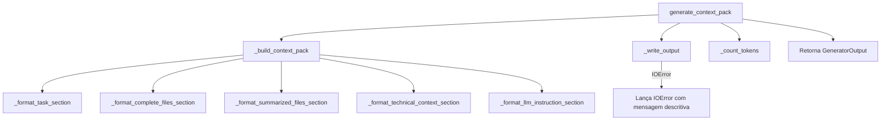
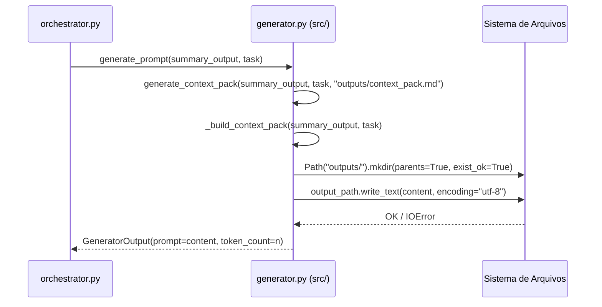

# Design Document — Context Pack Generator

## Overview

O `Context_Pack_Generator` é a etapa `generator` do pipeline Tokemize. Recebe a
`SummaryOutput` da etapa anterior e a `task` do usuário, monta um documento Markdown
estruturado (`context_pack.md`) com todo o contexto otimizado e o persiste em disco.

O módulo substitui o stub em `tokemize/generator.py` por uma implementação completa
em `src/tokemize/generator.py`, mantendo compatibilidade total com o orquestrador
existente via a função `generate_prompt(summary_output, task)`.

### Objetivos de Design

- **Legibilidade humana e machine-parseable**: o documento gerado deve ser legível
  por humanos e parseável por ferramentas de inspeção e testes via títulos `##` únicos.
- **Compatibilidade retroativa**: a assinatura `generate_prompt(summary_output, task)`
  deve continuar funcionando sem alterações no orquestrador.
- **Separação de responsabilidades**: a lógica de montagem do Markdown, a persistência
  em disco e o cálculo de token count são funções distintas e testáveis isoladamente.
- **Sem dependências externas novas**: usa apenas a stdlib Python (pathlib, logging,
  re) e os modelos já existentes em `tokemize/models.py`.

---

## Architecture

O módulo segue o padrão já estabelecido no pipeline: uma função pública principal
(`generate_context_pack`) que orquestra funções auxiliares privadas de formatação.

```
generate_context_pack(summary_output, task, output_path)
│
├── _build_context_pack(summary_output, task)   → str  (montagem do Markdown)
│   ├── _format_task_section(task)              → str
│   ├── _format_complete_files_section(files)   → str
│   ├── _format_summarized_files_section(...)   → str
│   ├── _format_technical_context_section(...)  → str
│   └── _format_llm_instruction_section()       → str
│
├── _write_output(content, output_path)         → None (I/O, lança IOError)
│
└── _count_tokens(content)                      → int  (len(content.split()))
```

A função `generate_prompt(summary_output, task)` é um wrapper de compatibilidade que
delega para `generate_context_pack` com o `output_path` padrão.

### Diagrama de Fluxo



### Integração com o Pipeline



---

## Components and Interfaces

### Função Pública Principal

```python
def generate_context_pack(
    summary_output: SummaryOutput,
    task: str,
    output_path: str | Path = "outputs/context_pack.md",
) -> GeneratorOutput:
    """Gera o Context Pack e o persiste em disco.

    Args:
        summary_output: Resultado da etapa de sumarização. Contém
            ``summarized_content``, ``token_count`` e ``files_summarized``.
            Os ``SelectedFile`` completos são obtidos via
            ``summary_output`` — ver nota de design abaixo.
        task: Descrição textual da tarefa técnica fornecida pelo usuário.
        output_path: Caminho do arquivo de saída. O diretório pai é criado
            automaticamente se não existir. Padrão: ``"outputs/context_pack.md"``.

    Returns:
        GeneratorOutput com ``prompt`` igual ao conteúdo completo do
        Context Pack gerado e ``token_count`` igual ao número de palavras
        em ``prompt`` (``len(prompt.split())``).

    Raises:
        IOError: Se o arquivo não puder ser escrito por falta de permissão
            ou outro erro de I/O. A mensagem inclui o caminho e a causa.
    """
```

> **Nota de design — acesso aos SelectedFiles**: A `SummaryOutput` atual não carrega
> os `SelectedFile` originais — ela contém apenas `summarized_content`,
> `token_count` e `files_summarized`. Para montar a seção `## Complete Files` com
> os arquivos completos, o módulo precisa receber a `SelectionOutput` também.
>
> **Decisão**: A assinatura pública `generate_context_pack` aceita um parâmetro
> opcional `selection_output: SelectionOutput | None = None`. Quando presente, os
> arquivos completos são incluídos na seção `## Complete Files`. Quando ausente
> (compatibilidade com o stub atual), a seção exibe `_Nenhum arquivo selecionado._`.
>
> O wrapper `generate_prompt(summary_output, task)` não passa `selection_output`,
> mantendo compatibilidade total com o orquestrador atual. A evolução futura do
> orquestrador pode passar a `SelectionOutput` diretamente.

### Assinatura Completa

```python
def generate_context_pack(
    summary_output: SummaryOutput,
    task: str,
    output_path: str | Path = "outputs/context_pack.md",
    selection_output: SelectionOutput | None = None,
) -> GeneratorOutput:
    ...

def generate_prompt(
    summary_output: SummaryOutput,
    task: str,
) -> GeneratorOutput:
    """Wrapper de compatibilidade com o orquestrador existente."""
    return generate_context_pack(summary_output, task)
```

### Constante de Instrução LLM

```python
LLM_INSTRUCTION: str = (
    "Você é um assistente de desenvolvimento de software especializado. "
    "Analise cuidadosamente o contexto fornecido nas seções acima — "
    "incluindo os arquivos completos, os resumos e o contexto técnico do "
    "repositório — e responda à tarefa descrita na seção '## Task'. "
    "Baseie sua resposta exclusivamente no contexto fornecido. "
    "Seja preciso, objetivo e forneça código funcional quando aplicável."
)
```

---

## Data Models

Os modelos são os já existentes em `tokemize/models.py`. Nenhum novo modelo é
necessário.

| Modelo | Papel no módulo |
|---|---|
| `SummaryOutput` | Input obrigatório: `summarized_content`, `files_summarized` |
| `SelectionOutput` | Input opcional: lista de `SelectedFile` para seção Complete Files |
| `SelectedFile` | Cada arquivo: `path`, `language`, `content`, `relevance_score` |
| `GeneratorOutput` | Output: `prompt` (conteúdo do Context Pack), `token_count` |

### Estrutura do Context Pack Gerado

```markdown
# Context Pack

## Task

{task}

## Complete Files

### {path_1}

```{language_1}
{content_1}
```

### {path_2}

```{language_2}
{content_2}
```

## Summarized Files

{summarized_content}

## Technical Context

Total de arquivos selecionados: {n}
Linguagens: {lang1}, {lang2}, ...

## LLM Instruction

{LLM_INSTRUCTION}
```

### Regras de Formatação

| Campo | Regra |
|---|---|
| `language` vazio ou `"unknown"` | Usar `text` como identificador do bloco |
| `SelectionOutput` vazia | Seção `## Complete Files` com `_Nenhum arquivo selecionado._` |
| `files_summarized == 0` | Seção `## Summarized Files` com `_Nenhum arquivo resumido._` |
| Linguagens no Technical Context | Únicas, ordenadas alfabeticamente |
| `SelectionOutput` vazia | `Linguagens: _nenhuma_` |

---

## Correctness Properties

*A property is a characteristic or behavior that should hold true across all valid
executions of a system — essentially, a formal statement about what the system should
do. Properties serve as the bridge between human-readable specifications and
machine-verifiable correctness guarantees.*

### Property 1: Round-trip do conteúdo — arquivo e GeneratorOutput são idênticos

*For any* `task`, `SummaryOutput` e `SelectionOutput` válidas, o campo `prompt` do
`GeneratorOutput` retornado SHALL ser igual ao conteúdo lido do arquivo gerado em
`output_path`.

**Validates: Requirements 1.4**

---

### Property 2: Sobrescrita idempotente

*For any* dois conjuntos de inputs distintos aplicados sequencialmente ao mesmo
`output_path`, o conteúdo final do arquivo SHALL ser igual ao conteúdo gerado pela
segunda chamada, não pela primeira.

**Validates: Requirements 1.3**

---

### Property 3: token_count é o número de palavras do prompt

*For any* `GeneratorOutput` retornado por `generate_context_pack`, `token_count`
SHALL ser igual a `len(prompt.split())`.

**Validates: Requirements 7.1, 7.2, 7.3**

---

### Property 4: Round-trip da seção Task

*For any* `task` string e `SelectionOutput` com pelo menos um `SelectedFile`, extrair
o conteúdo da seção `## Task` do Context Pack gerado SHALL retornar exatamente a
`task` fornecida como entrada.

**Validates: Requirements 2.1, 8.2**

---

### Property 5: Contagem de blocos de código equals número de SelectedFiles

*For any* `SelectionOutput` com `n` `SelectedFile`, o número de blocos de código
(delimitados por ` ``` `) na seção `## Complete Files` do Context Pack gerado SHALL
ser igual a `n`.

**Validates: Requirements 2.2, 3.4, 8.3**

---

### Property 6: Ordem das seções é sempre preservada

*For any* combinação de `task`, `SummaryOutput` e `SelectionOutput`, as posições das
seções `## Task`, `## Complete Files`, `## Summarized Files`, `## Technical Context`
e `## LLM Instruction` no Context Pack gerado SHALL aparecer nessa ordem, sem
exceção.

**Validates: Requirements 2.6**

---

### Property 7: Formatação de arquivos — path e linguagem corretos

*For any* `SelectedFile` com `path` e `language` não-vazios e não-`"unknown"`, o
Context Pack gerado SHALL conter `### {path}` e um bloco de código com identificador
`{language}` para esse arquivo.

**Validates: Requirements 3.1**

---

### Property 8: Fallback de linguagem para `text`

*For any* `SelectedFile` cujo campo `language` seja vazio (`""`) ou `"unknown"`, o
bloco de código correspondente no Context Pack gerado SHALL usar `text` como
identificador.

**Validates: Requirements 3.3**

---

### Property 9: Technical Context — total e linguagens corretos

*For any* `SelectionOutput` com `n` arquivos e conjunto de linguagens `L`, a seção
`## Technical Context` SHALL conter `Total de arquivos selecionados: n` e a lista de
linguagens únicas de `L` em ordem alfabética.

**Validates: Requirements 4.1, 4.2, 4.3**

---

### Property 10: LLM Instruction é estática e idempotente

*For any* dois conjuntos de inputs distintos, a seção `## LLM Instruction` extraída
de cada Context Pack gerado SHALL ser idêntica, confirmando que a instrução é uma
constante estática do módulo.

**Validates: Requirements 5.3**

---

### Property 11: Títulos de seção são únicos e identificáveis

*For any* Context Pack gerado, os títulos das seções de nível 2 (`##`) SHALL ser
únicos dentro do documento e corresponder exatamente ao conjunto esperado:
`{"Task", "Complete Files", "Summarized Files", "Technical Context", "LLM Instruction"}`.

**Validates: Requirements 8.1**

---

## Error Handling

### IOError na escrita do arquivo

```python
try:
    output_path.write_text(content, encoding="utf-8")
except OSError as exc:
    raise IOError(
        f"Falha ao escrever Context Pack em '{output_path}': {exc}"
    ) from exc
```

A mensagem inclui o caminho absoluto e a causa original (`exc`), facilitando
diagnóstico. O `OSError` original é encadeado via `from exc` para preservar o
traceback.

### Criação de diretório

```python
output_path.parent.mkdir(parents=True, exist_ok=True)
```

`exist_ok=True` garante que a chamada é idempotente — não lança exceção se o
diretório já existir. `parents=True` cria toda a hierarquia necessária.

### Valores de entrada inválidos

O módulo não valida os tipos dos parâmetros de entrada — essa responsabilidade
pertence ao orquestrador. Entradas `None` para `task` ou `summary_output` resultarão
em `AttributeError` ou `TypeError` naturais do Python, que o orquestrador captura
e registra como falha na etapa `generator`.

---

## Testing Strategy

### Abordagem Dual

A estratégia combina testes de exemplo (pytest) e testes de propriedade
(Hypothesis) para cobertura complementar:

- **Testes de exemplo**: verificam comportamentos específicos, casos de borda e
  condições de erro com inputs concretos.
- **Testes de propriedade**: verificam invariantes universais com inputs gerados
  aleatoriamente (mínimo 100 iterações por propriedade).

### Biblioteca de Property-Based Testing

**Hypothesis** (já presente em `pyproject.toml` como dependência de dev):
```toml
hypothesis>=6.100.0
```

### Organização dos Testes

Arquivo: `tests/test_generator.py`

```
tests/test_generator.py
├── Smoke tests
│   ├── test_import_generate_context_pack
│   └── test_import_generate_prompt_compat
│
├── Testes de exemplo
│   ├── test_creates_output_directory_automatically
│   ├── test_raises_ioerror_on_write_failure
│   ├── test_empty_selection_output_placeholder
│   ├── test_zero_files_summarized_placeholder
│   ├── test_empty_technical_context
│   ├── test_llm_instruction_present
│   ├── test_logging_emits_expected_messages
│   └── test_generate_prompt_compat_wrapper
│
└── Testes de propriedade (Hypothesis)
    ├── test_property_1_prompt_equals_file_content
    ├── test_property_2_overwrite_idempotent
    ├── test_property_3_token_count_is_word_count
    ├── test_property_4_task_round_trip
    ├── test_property_5_code_block_count_equals_files
    ├── test_property_6_section_order_preserved
    ├── test_property_7_file_path_and_language_in_output
    ├── test_property_8_unknown_language_fallback
    ├── test_property_9_technical_context_metadata
    ├── test_property_10_llm_instruction_is_static
    └── test_property_11_section_titles_unique
```

### Estratégias Hypothesis

```python
# Estratégia para SelectedFile
selected_file_strategy = st.builds(
    SelectedFile,
    path=st.text(min_size=1, max_size=50, alphabet=st.characters(
        whitelist_categories=("Lu", "Ll", "Nd"), whitelist_characters="/_.-"
    )),
    language=st.one_of(
        st.just("python"), st.just("javascript"), st.just("java"),
        st.just(""), st.just("unknown"),
    ),
    content=st.text(min_size=0, max_size=200),
    relevance_score=st.floats(min_value=0.0, max_value=1.0),
)

# Estratégia para SelectionOutput
selection_output_strategy = st.builds(
    SelectionOutput,
    task=st.text(min_size=1, max_size=100),
    selected_files=st.lists(selected_file_strategy, min_size=0, max_size=5),
    total_candidates=st.integers(min_value=0, max_value=100),
)

# Estratégia para SummaryOutput
summary_output_strategy = st.builds(
    SummaryOutput,
    summarized_content=st.text(min_size=0, max_size=500),
    token_count=st.integers(min_value=0, max_value=1000),
    files_summarized=st.integers(min_value=0, max_value=10),
)
```

### Configuração dos Testes de Propriedade

Cada teste de propriedade usa `@settings(max_examples=100)` e é anotado com um
comentário de rastreabilidade:

```python
# Feature: context-pack-generator, Property 1: prompt equals file content
@given(
    task=st.text(min_size=1, max_size=100),
    summary_output=summary_output_strategy,
    selection_output=selection_output_strategy,
)
@settings(max_examples=100)
def test_property_1_prompt_equals_file_content(
    task, summary_output, selection_output, tmp_path
):
    output_path = tmp_path / "context_pack.md"
    result = generate_context_pack(
        summary_output, task, output_path, selection_output
    )
    assert result.prompt == output_path.read_text(encoding="utf-8")
```

### Testes de Exemplo Críticos

**Criação automática de diretório**:
```python
def test_creates_output_directory_automatically(tmp_path):
    output_path = tmp_path / "new_dir" / "subdir" / "context_pack.md"
    generate_context_pack(SummaryOutput(), "task", output_path)
    assert output_path.exists()
```

**IOError em path sem permissão**:
```python
def test_raises_ioerror_on_write_failure(tmp_path):
    output_path = tmp_path / "context_pack.md"
    output_path.parent.chmod(0o444)  # somente leitura
    with pytest.raises(IOError, match=str(output_path)):
        generate_context_pack(SummaryOutput(), "task", output_path)
```

**Placeholder para seleção vazia**:
```python
def test_empty_selection_output_placeholder(tmp_path):
    result = generate_context_pack(
        SummaryOutput(), "task", tmp_path / "out.md", SelectionOutput()
    )
    assert "_Nenhum arquivo selecionado._" in result.prompt
```

### Cobertura Esperada

| Categoria | Cobertura alvo |
|---|---|
| Linhas do módulo `generator.py` | ≥ 90% |
| Branches (if/else) | ≥ 85% |
| Propriedades formais | 11/11 (100%) |
