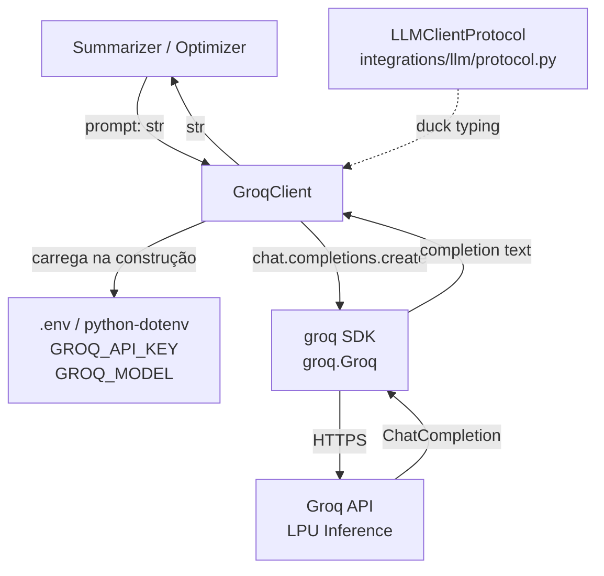
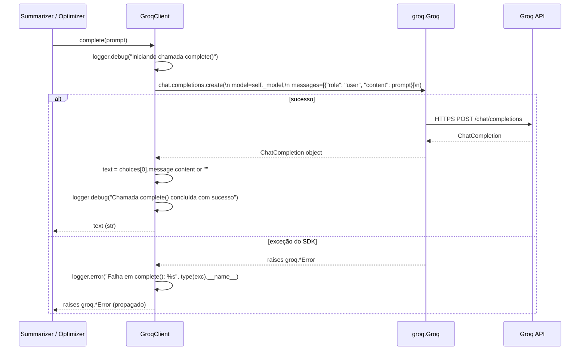

# Design Document — groq-llm-integration

## Overview

O módulo `groq_client.py` implementa `GroqClient`, a integração concreta do pipeline
Tokemize com o provedor de LLM [Groq](https://groq.com). O Groq oferece inferência de
alta velocidade via LPU (Language Processing Unit) para modelos como
`llama3-8b-8192`, tornando-o uma alternativa de baixa latência aos provedores OpenAI
e Anthropic já previstos na arquitetura.

O `GroqClient` segue o mesmo padrão dos demais clientes da camada `integrations/llm/`:
implementa `LLMClientProtocol` via duck typing, carrega credenciais exclusivamente via
variável de ambiente, e propaga exceções do SDK sem capturá-las — delegando o
tratamento de fallback à camada chamadora (ex: `Summarizer`).

### Posição no Pipeline

```
Summarizer / Optimizer
    ↓ prompt (str)
GroqClient  ←  GROQ_API_KEY (.env)
    ↓           GROQ_MODEL (.env)
groq SDK
    ↓
Groq API (LPU inference)
    ↓ completion (str)
GroqClient
    ↓ str
Summarizer / Optimizer
```

---

## Architecture

### Diagrama de Componentes



### Decisões de Design

**1. Propagação de exceções sem captura**
O `GroqClient` não captura exceções do `groq SDK`. Erros de autenticação
(`groq.AuthenticationError`), rede (`groq.APIConnectionError`), rate limit
(`groq.RateLimitError`) e outros são propagados diretamente. O `Summarizer` já
implementa o bloco `except Exception` com fallback — duplicar esse tratamento no
`GroqClient` criaria responsabilidade ambígua.

**2. Resolução do Model_ID em três camadas**
A precedência é: parâmetro do construtor → variável de ambiente `GROQ_MODEL` →
valor padrão `"llama3-8b-8192"`. Isso permite configuração por instância (testes,
múltiplos pipelines) sem exigir variável de ambiente obrigatória.

**3. Validação antecipada (fail-fast)**
A `GROQ_API_KEY` e o `model` são validados no `__init__`, não no `complete()`. Isso
garante que erros de configuração sejam detectados na inicialização do pipeline, não
durante uma chamada em produção.

**4. Logging sem exposição de dados sensíveis**
O `GroqClient` loga o início e o resultado de cada chamada a `complete()`, mas nunca
registra o conteúdo do prompt, o valor da API key ou o conteúdo da completion. Apenas
o tipo da exceção é logado em caso de erro.

**5. Compatibilidade estrutural com LLMClientProtocol**
O `GroqClient` não herda explicitamente de `LLMClientProtocol`. A compatibilidade é
garantida por duck typing (`typing.Protocol`), seguindo o padrão já estabelecido na
camada `integrations/llm/`.

---

## Components and Interfaces

### `GroqClient` (src/tokemize/integrations/llm/groq_client.py)

Classe principal do módulo. Encapsula a inicialização do `groq.Groq` e a chamada
`chat.completions.create`.

```python
import logging
import os
from dotenv import load_dotenv
import groq

logger = logging.getLogger(__name__)

DEFAULT_MODEL: str = "llama3-8b-8192"
ENV_API_KEY: str = "GROQ_API_KEY"
ENV_MODEL: str = "GROQ_MODEL"


class GroqClient:
    """Cliente concreto para o provedor Groq, compatível com LLMClientProtocol.

    Args:
        model: Identificador do modelo Groq. Se omitido, usa GROQ_MODEL do
            ambiente ou o padrão "llama3-8b-8192".

    Raises:
        EnvironmentError: Se GROQ_API_KEY não estiver definida ou estiver vazia.
        ValueError: Se o model_id fornecido for uma string vazia.
    """

    def __init__(self, model: str | None = None) -> None: ...

    def complete(self, prompt: str) -> str:
        """Envia um prompt ao modelo Groq e retorna a completion como str.

        Args:
            prompt: Texto de entrada para o modelo.

        Returns:
            Texto da completion retornado pelo modelo, ou string vazia se a
            API retornar uma completion nula.

        Raises:
            groq.AuthenticationError: Se a API key for inválida ou expirada.
            groq.APIConnectionError: Se houver falha de rede ou timeout.
            groq.RateLimitError: Se o rate limit da API for excedido.
            groq.APIStatusError: Para outros erros HTTP da API Groq.
        """
        ...
```

**Responsabilidades:**
- Carregar `GROQ_API_KEY` via `python-dotenv` e validar na construção
- Resolver `model` com precedência: parâmetro → `GROQ_MODEL` env → `DEFAULT_MODEL`
- Validar que `model` é uma `str` não vazia
- Instanciar `groq.Groq(api_key=...)` internamente
- Enviar o prompt como mensagem `role="user"` via `chat.completions.create`
- Retornar `choices[0].message.content or ""` como `str`
- Propagar exceções do SDK sem modificá-las
- Logar início e resultado de cada chamada (sem dados sensíveis)

### `LLMClientProtocol` (src/tokemize/integrations/llm/protocol.py)

Protocolo já definido pela spec `tokemize-summarizer`. O `GroqClient` é
estruturalmente compatível sem herança explícita.

```python
from typing import Protocol

class LLMClientProtocol(Protocol):
    def complete(self, prompt: str) -> str:
        """Envia um prompt ao LLM e retorna a resposta como str."""
        ...
```

### `__init__.py` (src/tokemize/integrations/llm/__init__.py)

Exporta `GroqClient` e `LLMClientProtocol` para uso pelo pipeline:

```python
from tokemize.integrations.llm.protocol import LLMClientProtocol
from tokemize.integrations.llm.groq_client import GroqClient

__all__ = ["LLMClientProtocol", "GroqClient"]
```

---

## Data Models

### Fluxo de dados interno do `GroqClient`



### Estrutura da chamada ao SDK

```python
# Chamada interna ao groq SDK
response = self._client.chat.completions.create(
    model=self._model,
    messages=[
        {"role": "user", "content": prompt}
    ],
)
return response.choices[0].message.content or ""
```

### Constantes do módulo

```python
DEFAULT_MODEL: str = "llama3-8b-8192"
ENV_API_KEY: str = "GROQ_API_KEY"
ENV_MODEL: str = "GROQ_MODEL"
```

### Resolução do Model_ID

```
__init__(model=None)
    │
    ├─ model não None e não vazio → usa model
    ├─ model é str vazia → ValueError
    ├─ model é None → lê os.getenv("GROQ_MODEL")
    │       ├─ definido e não vazio → usa GROQ_MODEL
    │       └─ não definido ou vazio → usa DEFAULT_MODEL ("llama3-8b-8192")
    └─ armazena em self._model: str
```

### Resolução da API Key

```
__init__
    │
    ├─ load_dotenv()  # carrega .env se existir
    ├─ api_key = os.getenv("GROQ_API_KEY")
    ├─ api_key é None ou vazia → EnvironmentError("GROQ_API_KEY não definida...")
    └─ self._client = groq.Groq(api_key=api_key)
```

---

## Correctness Properties

*A property is a characteristic or behavior that should hold true across all valid
executions of a system — essentially, a formal statement about what the system should
do. Properties serve as the bridge between human-readable specifications and
machine-verifiable correctness guarantees.*

### Property 1: Retorno de `complete()` é sempre `str`

*Para qualquer* prompt não vazio fornecido ao `GroqClient` com mock do SDK configurado
para retornar uma completion válida, `complete(prompt)` SHALL retornar um valor do
tipo `str`.

**Validates: Requirements 1.3, 4.2, 7.4**

---

### Property 2: Completion nula ou vazia retorna string vazia

*Para qualquer* prompt, se o mock do SDK retornar `None` ou string vazia em
`choices[0].message.content`, `complete(prompt)` SHALL retornar `""` (string vazia,
tipo `str`), sem lançar exceção.

**Validates: Requirements 4.4**

---

### Property 3: Exceções do SDK são propagadas sem modificação

*Para qualquer* prompt e qualquer exceção lançada pelo mock do SDK, `complete(prompt)`
SHALL propagar a mesma exceção (mesmo tipo e instância) sem capturá-la, modificá-la
ou envolvê-la em outro tipo de exceção.

**Validates: Requirements 4.5, 5.1, 5.2, 7.5**

---

### Property 4: API key ausente ou vazia lança EnvironmentError na construção

*Para qualquer* ambiente onde `GROQ_API_KEY` não está definida, está vazia ou contém
apenas whitespace, instanciar `GroqClient()` SHALL lançar `EnvironmentError` com
mensagem contendo o nome da variável ausente (`"GROQ_API_KEY"`).

**Validates: Requirements 2.2**

---

### Property 5: Model_ID vazio lança ValueError na construção

*Para qualquer* string vazia fornecida como `model` no construtor, instanciar
`GroqClient(model="")` SHALL lançar `ValueError` com mensagem descritiva, sem
realizar nenhuma chamada ao SDK ou à API.

**Validates: Requirements 3.3, 3.4**

---

### Property 6: Resolução do model segue precedência correta

*Para qualquer* combinação de parâmetro `model` (não vazio ou None) e variável de
ambiente `GROQ_MODEL` (definida ou não), o `GroqClient` SHALL usar o modelo com a
precedência: parâmetro do construtor → `GROQ_MODEL` env → `DEFAULT_MODEL`
(`"llama3-8b-8192"`), e o modelo efetivo SHALL ser sempre uma string não vazia.

**Validates: Requirements 3.1, 3.2**

---

### Property 7: Dados sensíveis não aparecem em logs

*Para qualquer* API key e qualquer prompt, todos os registros de log produzidos
durante a construção do `GroqClient` e durante chamadas a `complete()` SHALL não
conter o valor da API key nem o conteúdo do prompt.

**Validates: Requirements 2.3, 5.3**

---

## Error Handling

### Exceções do groq SDK

O `GroqClient` **não captura** exceções do SDK. Todas são propagadas diretamente:

| Exceção | Causa | Tratamento |
|---|---|---|
| `groq.AuthenticationError` | API key inválida ou expirada | Propagada |
| `groq.APIConnectionError` | Falha de rede ou timeout | Propagada |
| `groq.RateLimitError` | Rate limit excedido | Propagada |
| `groq.APIStatusError` | Outros erros HTTP (4xx, 5xx) | Propagada |

O `Summarizer` (camada chamadora) já implementa `except Exception` com retorno de
`FALLBACK_MESSAGE`. Não há duplicação de tratamento.

### GROQ_API_KEY ausente

Validada no `__init__` com fail-fast:

```python
load_dotenv()
api_key = os.getenv(ENV_API_KEY)
if not api_key:
    raise EnvironmentError(
        f"Variável de ambiente '{ENV_API_KEY}' não definida ou vazia. "
        "Defina-a no arquivo .env ou no ambiente do sistema."
    )
```

### Model_ID inválido

Validado no `__init__` antes de qualquer chamada ao SDK:

```python
if model is not None and not model:
    raise ValueError(
        "O parâmetro 'model' não pode ser uma string vazia. "
        f"Use None para o padrão ('{DEFAULT_MODEL}') ou forneça um model_id válido."
    )
```

### Completion nula

Se `choices[0].message.content` for `None` (comportamento possível do SDK), o
`GroqClient` retorna `""` via `or ""`, sem lançar exceção:

```python
return response.choices[0].message.content or ""
```

### Logging de erros

Em caso de exceção propagada, o `GroqClient` loga apenas o tipo da exceção:

```python
except Exception as exc:
    logger.error("Falha em complete(): %s", type(exc).__name__)
    raise
```

---

## Testing Strategy

### Abordagem Dual

O módulo usa **testes unitários com mocks** para cobrir exemplos concretos e casos de
borda, e **testes baseados em propriedades** (property-based testing) para verificar
invariantes universais do método `complete()`.

### Property-Based Testing

**Biblioteca:** `hypothesis` (já presente no projeto como dependência de dev)

Cada propriedade do design é implementada como um único teste com `@given`,
configurado para rodar no mínimo 100 iterações. Cada teste é anotado com um
comentário referenciando a propriedade do design:

```
# Feature: groq-llm-integration, Property N: <texto da propriedade>
```

**Propriedades a implementar:**

| Teste | Propriedade | Requisito |
|---|---|---|
| `test_complete_always_returns_str` | Property 1 | 1.3, 4.2, 7.4 |
| `test_complete_returns_empty_str_for_null_content` | Property 2 | 4.4 |
| `test_complete_propagates_sdk_exceptions` | Property 3 | 4.5, 5.1, 5.2, 7.5 |
| `test_missing_api_key_raises_environment_error` | Property 4 | 2.2 |
| `test_empty_model_raises_value_error` | Property 5 | 3.3, 3.4 |
| `test_model_resolution_precedence` | Property 6 | 3.1, 3.2 |
| `test_sensitive_data_not_logged` | Property 7 | 2.3, 5.3 |

**Estratégias de geração (Hypothesis):**

```python
from hypothesis import given, settings
from hypothesis import strategies as st

# Gera prompts não vazios (qualquer texto)
prompt_strategy = st.text(min_size=1)

# Gera completions como texto arbitrário (incluindo vazio)
completion_strategy = st.text()

# Gera model_ids válidos (strings não vazias)
model_id_strategy = st.text(min_size=1).filter(lambda s: s.strip())

# Gera strings vazias para testar validação
empty_str_strategy = st.just("")
```

### Testes Unitários (pytest)

Cobrem casos específicos e de borda não adequados para PBT:

- `test_groq_client_instantiation_with_valid_env` — construção bem-sucedida com env válido
- `test_groq_client_uses_env_model_when_no_param` — resolução via `GROQ_MODEL` env
- `test_groq_client_uses_default_model_when_no_env` — fallback para `DEFAULT_MODEL`
- `test_groq_client_uses_constructor_model_over_env` — parâmetro tem precedência sobre env
- `test_complete_sends_user_role_message` — prompt enviado como `role="user"`
- `test_api_key_not_logged` — API key não aparece em logs
- `test_prompt_content_not_logged` — conteúdo do prompt não aparece em logs
- `test_groq_client_exported_from_init` — importável via `from tokemize.integrations.llm import GroqClient`

### Mocks

Todos os testes usam mocks para o `groq SDK`, sem chamadas reais à API:

```python
from unittest.mock import MagicMock, patch

# Mock do cliente groq.Groq
mock_groq_client = MagicMock()
mock_groq_client.chat.completions.create.return_value = MagicMock(
    choices=[MagicMock(message=MagicMock(content="resposta mock"))]
)

# Patch do construtor groq.Groq
with patch("tokemize.integrations.llm.groq_client.groq.Groq") as mock_groq:
    mock_groq.return_value = mock_groq_client
    client = GroqClient()
```

### Localização dos testes

```
tests/
└── test_groq_client.py   # espelha src/tokemize/integrations/llm/groq_client.py
```

### Configuração do pytest

Nenhuma alteração necessária nas dependências existentes. O `hypothesis` já está
presente como dependência de desenvolvimento. Variáveis de ambiente são mockadas
via `unittest.mock.patch.dict(os.environ, {...})` nos testes — sem necessidade de
arquivo `.env` real durante a execução da suite.
