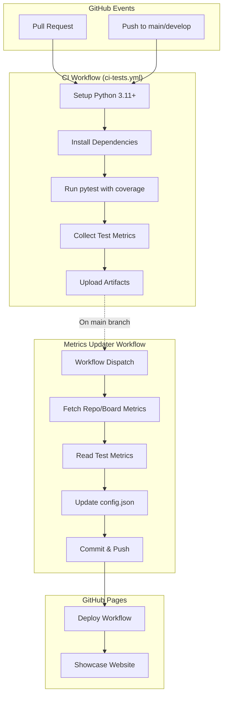

# Design Document: Test Pipeline Showcase

## Overview

Este documento descreve o design técnico para a feature **test-pipeline-showcase**, que implementa uma pipeline de CI/CD automatizada para executar testes pytest e publicar métricas de teste na showcase do projeto via GitHub Pages.

### Objetivos

1. **Automação de Testes**: Executar testes automaticamente em pull requests e pushes para branches principais
2. **Coleta de Métricas**: Capturar métricas detalhadas de execução de testes (total, passados, falhados, cobertura)
3. **Integração com Showcase**: Publicar métricas de teste no config.json para visualização na showcase
4. **Resiliência**: Garantir que falhas em testes não quebrem a pipeline de métricas

### Contexto

O projeto Tokemize já possui:
- Sistema de showcase baseado em GitHub Pages (docs/showcase/)
- Workflow de atualização de métricas (update-board-metrics.yml)
- Arquivo de configuração centralizado (docs/showcase/config.json)
- Suite de testes pytest com Hypothesis para property-based testing
- Configuração pytest em pyproject.toml

Esta feature adiciona:
- Novo workflow CI para execução de testes (ci-tests.yml)
- Componente de coleta de métricas de teste
- Nova seção "testMetrics" no config.json
- Integração entre CI e metrics updater

## Architecture

### Visão Geral da Arquitetura



### Componentes Principais

#### 1. CI Workflow (ci-tests.yml)

**Responsabilidade**: Executar testes pytest em eventos de PR e push, coletar métricas e disponibilizá-las para o metrics updater.

**Triggers**:
- `pull_request` (opened, synchronize, reopened) - todas as branches
- `push` - apenas branches `main` e `develop`

**Jobs**:
- `test`: Executa testes e coleta métricas

**Concurrency**: Usa grupo `ci-tests-${{ github.ref }}` para evitar execuções paralelas na mesma branch.

#### 2. Test Metrics Collector

**Responsabilidade**: Extrair métricas estruturadas dos resultados de pytest e coverage.

**Inputs**:
- pytest JSON report (--json-report)
- coverage JSON report (coverage.json)
- pytest exit code

**Outputs**:
- test-metrics.json com estrutura padronizada

**Localização**: Script Python inline no workflow ou arquivo separado em `.github/scripts/collect_test_metrics.py`

#### 3. Metrics Updater Integration

**Responsabilidade**: Integrar métricas de teste ao config.json existente.

**Modificações no update-board-metrics.yml**:
- Adicionar step para ler test-metrics.json (se disponível)
- Adicionar lógica Python para merge de testMetrics no config.json
- Preservar valores anteriores em caso de falha na coleta

## Components and Interfaces

### Component 1: CI Workflow (ci-tests.yml)

```yaml
name: CI Tests
on:
  pull_request:
    types: [opened, synchronize, reopened]
  push:
    branches: [main, develop]

concurrency:
  group: ci-tests-${{ github.ref }}
  cancel-in-progress: true

jobs:
  test:
    name: Run Tests & Collect Metrics
    runs-on: ubuntu-latest
    timeout-minutes: 10
    
    steps:
      - name: Checkout
      - name: Setup Python 3.11
      - name: Install dependencies
      - name: Run pytest with coverage
      - name: Collect test metrics
      - name: Upload test results
      - name: Upload coverage report
```

**Interface com outros componentes**:
- **Input**: Código-fonte do repositório
- **Output**: 
  - test-metrics.json (artifact)
  - coverage.json (artifact)
  - pytest-report.json (artifact)
  - Exit code (success/failure)

### Component 2: Test Metrics Collector Script

**Arquivo**: `.github/scripts/collect_test_metrics.py`

**Interface**:

```python
def collect_test_metrics(
    pytest_json_path: str,
    coverage_json_path: str | None,
    pytest_exit_code: int
) -> dict:
    """
    Coleta métricas de teste a partir dos relatórios pytest e coverage.
    
    Args:
        pytest_json_path: Caminho para pytest-report.json
        coverage_json_path: Caminho para coverage.json (opcional)
        pytest_exit_code: Exit code do pytest (0=success, 1=failures, >1=error)
    
    Returns:
        Dict com estrutura testMetrics:
        {
            "totalTests": int,
            "passed": int,
            "failed": int,
            "skipped": int,
            "duration": float,
            "coverage": float | null,
            "lastRunAt": str (ISO 8601),
            "status": "passing" | "failing" | "unknown"
        }
    """
```

**Lógica de Status**:
```python
if pytest_exit_code > 1:
    status = "unknown"  # Erro na execução
elif failed > 0:
    status = "failing"
elif total_tests > 0:
    status = "passing"
else:
    status = "unknown"  # Nenhum teste encontrado
```

### Component 3: Metrics Updater Enhancement

**Modificações no update-board-metrics.yml**:

```yaml
# Novo step após "Fetch all metrics via REST + GraphQL"
- name: Read test metrics (if available)
  id: test_metrics
  run: |
    if [ -f "/tmp/test-metrics.json" ]; then
      echo "Test metrics found"
      cat /tmp/test-metrics.json > /tmp/test_metrics_data.json
    else
      echo "No test metrics available, will use previous values"
      echo "{}" > /tmp/test_metrics_data.json
    fi
```

**Modificações no script Python**:

```python
# Ler métricas de teste
test_metrics_new = read_json("/tmp/test_metrics_data.json", {})

# Preservar valores anteriores se não houver novos dados
if test_metrics_new:
    config["testMetrics"] = test_metrics_new
elif "testMetrics" not in config:
    # Inicializar com valores padrão se não existir
    config["testMetrics"] = {
        "totalTests": 0,
        "passed": 0,
        "failed": 0,
        "skipped": 0,
        "duration": 0.0,
        "coverage": None,
        "lastRunAt": None,
        "status": "unknown"
    }
# Caso contrário, mantém valores existentes em config["testMetrics"]
```

## Data Models

### TestMetrics Schema

```json
{
  "testMetrics": {
    "totalTests": 42,
    "passed": 40,
    "failed": 2,
    "skipped": 0,
    "duration": 12.34,
    "coverage": 85.5,
    "lastRunAt": "2026-05-13T14:30:00Z",
    "status": "failing"
  }
}
```

**Field Specifications**:

| Campo | Tipo | Constraints | Descrição |
|-------|------|-------------|-----------|
| `totalTests` | integer | [0, 999999] | Número total de testes executados |
| `passed` | integer | [0, totalTests] | Testes que passaram |
| `failed` | integer | [0, totalTests] | Testes que falharam ou erraram |
| `skipped` | integer | [0, totalTests] | Testes pulados |
| `duration` | float | [0.0, 86400.0] | Tempo de execução em segundos |
| `coverage` | float \| null | [0.0, 100.0] | Cobertura de código em % (null se indisponível) |
| `lastRunAt` | string \| null | ISO 8601 UTC | Timestamp da última execução |
| `status` | string | enum | "passing", "failing", ou "unknown" |

**Invariants**:
- `passed + failed + skipped <= totalTests`
- `status = "failing"` ⟺ `failed > 0`
- `status = "passing"` ⟺ `failed == 0 AND totalTests > 0`
- `status = "unknown"` ⟺ `totalTests == 0 OR lastRunAt == null OR pytest_exit_code > 1`

### Pytest JSON Report Structure

Pytest com plugin `pytest-json-report` gera:

```json
{
  "summary": {
    "total": 42,
    "passed": 40,
    "failed": 2,
    "skipped": 0
  },
  "duration": 12.34,
  "tests": [
    {
      "nodeid": "tests/test_example.py::test_function",
      "outcome": "passed",
      "duration": 0.12
    }
  ]
}
```

### Coverage JSON Report Structure

Coverage.py gera:

```json
{
  "totals": {
    "percent_covered": 85.5,
    "num_statements": 1000,
    "missing_lines": 145
  },
  "files": {
    "src/tokemize/module.py": {
      "summary": {
        "percent_covered": 90.0
      }
    }
  }
}
```


## Correctness Properties

*A property is a characteristic or behavior that should hold true across all valid executions of a system—essentially, a formal statement about what the system should do. Properties serve as the bridge between human-readable specifications and machine-verifiable correctness guarantees.*

### Property 1: Metrics Extraction Correctness

*For any* valid pytest JSON report and optional coverage JSON report, the Test_Metrics_Collector SHALL correctly extract all metric fields (totalTests, passed, failed, skipped, duration, coverage) matching the values in the source reports.

**Validates: Requirements 2.1, 2.2, 2.3, 2.4, 2.6**

### Property 2: Test Metrics Validation

*For any* test metrics object, all fields SHALL satisfy their constraints: totalTests ∈ [0, 999999], passed ∈ [0, totalTests], failed ∈ [0, totalTests], skipped ∈ [0, totalTests], duration ∈ [0.0, 86400.0], coverage ∈ [0.0, 100.0] ∪ {null}, and status ∈ {"passing", "failing", "unknown"}.

**Validates: Requirements 5.1, 5.2, 5.3, 5.4, 5.5, 5.6, 5.8**

### Property 3: Status Calculation Correctness

*For any* test metrics object, the status field SHALL be correctly calculated: status = "failing" when failed > 0, status = "passing" when failed == 0 AND totalTests > 0, and status = "unknown" when totalTests == 0 OR lastRunAt is null OR pytest_exit_code > 1.

**Validates: Requirements 5.9, 5.10, 5.11**

### Property 4: Config Merge Preserves Existing Data

*For any* valid config.json with existing sections (repoStats, boardMetrics, contributors, prAuthors) and any new test metrics, merging SHALL preserve all existing sections unchanged while adding or updating the testMetrics section.

**Validates: Requirements 4.1, 4.2, 4.3**

### Property 5: Timestamp ISO 8601 UTC Format

*For any* timestamp value, when formatted for testMetrics.lastRunAt, it SHALL be in ISO 8601 format with UTC timezone and second precision (format: "YYYY-MM-DDTHH:MM:SSZ").

**Validates: Requirements 4.4, 5.7**

### Property 6: Test Metrics JSON Serialization Round-Trip

*For any* valid test metrics object, serializing to JSON and deserializing SHALL produce an equivalent object with all fields preserved and correctly typed.

**Validates: Requirements 2.7, 8.2**

### Property 7: Duration Precision

*For any* duration value in seconds, when processed by the Test_Metrics_Collector, it SHALL be rounded to exactly 2 decimal places.

**Validates: Requirements 2.5**

### Property 8: Metrics Sum Invariant

*For any* test metrics object, the invariant passed + failed + skipped ≤ totalTests SHALL always hold.

**Validates: Requirements 5.1, 5.2, 5.3, 5.4** (implicit constraint)

## Error Handling

### Error Categories

#### 1. Pytest Execution Errors

**Scenario**: pytest fails to execute (exit code > 1)

**Handling**:
- Test_Metrics_Collector sets status to "unknown"
- Logs error with exit code and stderr output
- Generates test-metrics.json with partial data (exit code, timestamp, status="unknown")
- CI workflow continues (does not fail)

**Rationale**: Metrics collection failure should not block the CI pipeline. The "unknown" status signals that something went wrong.

#### 2. Missing Coverage Data

**Scenario**: pytest-cov not installed or coverage report not generated

**Handling**:
- Test_Metrics_Collector omits coverage field (sets to null)
- Logs warning message
- Continues with other metrics collection
- CI workflow succeeds

**Rationale**: Coverage is optional. Tests can run without coverage reporting.

#### 3. Malformed JSON Reports

**Scenario**: pytest or coverage JSON reports are corrupted or missing expected fields

**Handling**:
- Test_Metrics_Collector catches JSON parsing errors
- Logs error with file path and parse error details
- Sets status to "unknown"
- Uses default values for missing fields (0 for counts, null for optional fields)

**Rationale**: Partial data is better than no data. Default values allow the system to continue.

#### 4. Config.json Corruption

**Scenario**: config.json is malformed or missing required sections

**Handling**:
- Metrics_Updater creates backup: `config.json.backup.{timestamp}`
- Attempts to parse and repair JSON
- If repair fails, initializes new config.json with default structure
- Logs error and backup location

**Rationale**: Preserve data before attempting fixes. Always have a recovery path.

#### 5. Metrics Collection Timeout

**Scenario**: Test execution exceeds 10-minute timeout

**Handling**:
- GitHub Actions terminates workflow with status "timed_out"
- No metrics are collected
- Metrics_Updater preserves previous testMetrics values
- Logs timeout event

**Rationale**: Timeouts indicate systemic issues. Preserve last known good state.

### Error Recovery Patterns

#### Pattern 1: Fallback to Previous Values

```python
def update_test_metrics(config: dict, new_metrics: dict | None) -> dict:
    """Update config with new test metrics, falling back to previous values."""
    if new_metrics and is_valid_metrics(new_metrics):
        config["testMetrics"] = new_metrics
    elif "testMetrics" not in config:
        # Initialize with safe defaults
        config["testMetrics"] = get_default_metrics()
    # else: keep existing values
    return config
```

#### Pattern 2: Graceful Degradation

```python
def collect_coverage(coverage_path: str) -> float | None:
    """Collect coverage, returning None if unavailable."""
    try:
        with open(coverage_path) as f:
            data = json.load(f)
            return data["totals"]["percent_covered"]
    except (FileNotFoundError, KeyError, json.JSONDecodeError) as e:
        logger.warning(f"Coverage unavailable: {e}")
        return None  # Graceful degradation
```

#### Pattern 3: Validation with Defaults

```python
def validate_metrics(metrics: dict) -> dict:
    """Validate and sanitize metrics, applying defaults for invalid values."""
    return {
        "totalTests": clamp(metrics.get("totalTests", 0), 0, 999999),
        "passed": clamp(metrics.get("passed", 0), 0, metrics.get("totalTests", 0)),
        "failed": clamp(metrics.get("failed", 0), 0, metrics.get("totalTests", 0)),
        "skipped": clamp(metrics.get("skipped", 0), 0, metrics.get("totalTests", 0)),
        "duration": clamp(metrics.get("duration", 0.0), 0.0, 86400.0),
        "coverage": validate_coverage(metrics.get("coverage")),
        "lastRunAt": metrics.get("lastRunAt"),
        "status": metrics.get("status", "unknown")
    }
```

### Logging Strategy

**Log Levels**:
- **ERROR**: Pytest execution failure (exit code > 1), JSON parsing errors, config corruption
- **WARNING**: Missing coverage, missing optional fields, fallback to previous values
- **INFO**: Successful metrics collection, config update, workflow completion
- **DEBUG**: Detailed parsing steps, field extraction, validation results

**Log Format**:
```
[LEVEL] [Component] Message
[ERROR] [TestMetricsCollector] Failed to parse pytest report: Unexpected EOF at line 42
[WARNING] [TestMetricsCollector] Coverage report not found, omitting coverage field
[INFO] [MetricsUpdater] Updated config.json with test metrics (42 tests, 40 passed)
```

## Testing Strategy

### Testing Approach

This feature requires a **dual testing approach**:

1. **Property-Based Tests**: Verify universal properties of the metrics collector and config updater logic
2. **Integration Tests**: Verify GitHub Actions workflows, file I/O, and end-to-end behavior
3. **Smoke Tests**: Verify workflow configuration and setup

### Property-Based Testing

**Library**: Hypothesis (already in project dependencies)

**Configuration**: Minimum 100 iterations per property test

**Test Organization**:
- File: `tests/test_metrics_collector_properties.py`
- Each property test references its design document property via comment tag

**Property Test Tags**:
```python
# Feature: test-pipeline-showcase, Property 1: Metrics Extraction Correctness
def test_metrics_extraction_correctness(pytest_report, coverage_report):
    ...

# Feature: test-pipeline-showcase, Property 2: Test Metrics Validation
def test_metrics_validation(metrics):
    ...
```

**Generators**:
```python
from hypothesis import given, strategies as st

# Generator for pytest JSON reports
@st.composite
def pytest_report(draw):
    total = draw(st.integers(min_value=0, max_value=1000))
    passed = draw(st.integers(min_value=0, max_value=total))
    remaining = total - passed
    failed = draw(st.integers(min_value=0, max_value=remaining))
    skipped = remaining - failed
    duration = draw(st.floats(min_value=0.0, max_value=3600.0))
    
    return {
        "summary": {
            "total": total,
            "passed": passed,
            "failed": failed,
            "skipped": skipped
        },
        "duration": duration
    }

# Generator for coverage reports
@st.composite
def coverage_report(draw):
    percent = draw(st.floats(min_value=0.0, max_value=100.0))
    return {
        "totals": {
            "percent_covered": percent
        }
    }

# Generator for test metrics
@st.composite
def test_metrics(draw):
    total = draw(st.integers(min_value=0, max_value=999999))
    passed = draw(st.integers(min_value=0, max_value=total))
    remaining = total - passed
    failed = draw(st.integers(min_value=0, max_value=remaining))
    skipped = remaining - failed
    
    return {
        "totalTests": total,
        "passed": passed,
        "failed": failed,
        "skipped": skipped,
        "duration": draw(st.floats(min_value=0.0, max_value=86400.0)),
        "coverage": draw(st.none() | st.floats(min_value=0.0, max_value=100.0)),
        "lastRunAt": draw(st.none() | st.datetimes()),
        "status": draw(st.sampled_from(["passing", "failing", "unknown"]))
    }
```

### Integration Tests

**Test Scenarios**:

1. **Workflow Trigger Test**:
   - Create test PR
   - Verify ci-tests.yml executes
   - Verify test results are uploaded as artifacts

2. **Metrics Collection Test**:
   - Run pytest with known test suite
   - Verify test-metrics.json is generated
   - Verify metrics match expected values

3. **Config Update Test**:
   - Provide test-metrics.json
   - Run metrics updater
   - Verify config.json contains testMetrics section
   - Verify existing sections preserved

4. **End-to-End Test**:
   - Push to main branch
   - Verify CI runs tests
   - Verify metrics updater triggers
   - Verify config.json updated
   - Verify showcase displays metrics

### Unit Tests

**Test Coverage**:

1. **Metrics Collector**:
   - Test extraction from valid reports
   - Test handling of missing fields
   - Test error handling for malformed JSON
   - Test status calculation logic
   - Test duration rounding

2. **Config Updater**:
   - Test JSON merge logic
   - Test preservation of existing sections
   - Test fallback to previous values
   - Test backup creation
   - Test timestamp formatting

3. **Validation**:
   - Test field constraint validation
   - Test enum validation
   - Test invariant checking (passed + failed + skipped ≤ totalTests)

### Test Execution

**Local Testing**:
```bash
# Run all tests
pytest tests/ -v

# Run property tests only
pytest tests/test_metrics_collector_properties.py -v

# Run with coverage
pytest tests/ --cov=src/tokemize --cov-report=term --cov-report=json
```

**CI Testing**:
- All tests run automatically on PR and push
- Property tests run with 100 iterations
- Coverage report generated and uploaded
- Test metrics collected and published

### Test Data

**Fixtures**:
- `tests/fixtures/pytest-report-sample.json`: Sample pytest JSON report
- `tests/fixtures/coverage-sample.json`: Sample coverage JSON report
- `tests/fixtures/config-sample.json`: Sample config.json with existing sections

**Test Utilities**:
- `tests/utils/metrics_helpers.py`: Helper functions for generating test data
- `tests/utils/json_helpers.py`: Helper functions for JSON manipulation

## Implementation Notes

### Pytest JSON Report Plugin

The CI workflow needs to generate pytest JSON reports. Two options:

**Option 1: pytest-json-report** (recommended)
```bash
pip install pytest-json-report
pytest --json-report --json-report-file=pytest-report.json
```

**Option 2: pytest --json** (built-in, limited)
```bash
pytest --json=pytest-report.json
```

Recommendation: Use pytest-json-report for richer output format.

### Coverage Configuration

Add to pyproject.toml:
```toml
[tool.coverage.json]
output = "coverage.json"

[tool.coverage.report]
precision = 2
```

### Workflow Artifacts

Artifacts to upload:
- `pytest-report.json`: Full pytest execution report
- `coverage.json`: Coverage data in JSON format
- `test-metrics.json`: Processed metrics for metrics updater
- `.coverage`: Coverage database (for debugging)

Retention: 7 days (GitHub Actions default)

### Concurrency Control

```yaml
concurrency:
  group: ci-tests-${{ github.ref }}
  cancel-in-progress: true
```

This ensures:
- Only one CI run per branch at a time
- New pushes cancel previous runs
- Saves CI minutes

### Metrics Updater Trigger

The CI workflow should trigger metrics updater only on main branch:

```yaml
- name: Trigger metrics updater
  if: github.ref == 'refs/heads/main' && github.event_name == 'push'
  run: |
    gh workflow run update-board-metrics.yml
  env:
    GH_TOKEN: ${{ secrets.PROJECT_TOKEN }}
```

### Security Considerations

1. **Token Permissions**: Use `PROJECT_TOKEN` with minimal required permissions (contents: write)
2. **Artifact Access**: Test artifacts are public by default; ensure no sensitive data in reports
3. **JSON Injection**: Validate and sanitize all JSON inputs before processing
4. **Path Traversal**: Use absolute paths and validate file locations

### Performance Considerations

1. **Test Execution Time**: Target < 5 minutes for full test suite
2. **Metrics Collection Time**: Target < 10 seconds for metrics processing
3. **Config Update Time**: Target < 5 seconds for JSON merge and commit
4. **Artifact Upload Time**: Compress large artifacts to reduce upload time

### Monitoring and Observability

**Metrics to Track**:
- CI workflow success rate
- Average test execution time
- Test failure rate
- Coverage trend over time
- Metrics collection failure rate

**Alerts**:
- CI workflow timeout (> 10 minutes)
- Test failure rate > 10%
- Coverage drop > 5% from previous run
- Metrics collection failure

## Deployment Plan

### Phase 1: CI Workflow Setup

1. Create `.github/workflows/ci-tests.yml`
2. Add pytest-json-report to dev dependencies
3. Configure pytest for JSON output
4. Test workflow on feature branch
5. Merge to develop

### Phase 2: Metrics Collector

1. Create `.github/scripts/collect_test_metrics.py`
2. Implement metrics extraction logic
3. Add unit tests for metrics collector
4. Add property tests for metrics validation
5. Test end-to-end on feature branch
6. Merge to develop

### Phase 3: Metrics Updater Integration

1. Modify `update-board-metrics.yml` to read test metrics
2. Update Python script to merge testMetrics into config.json
3. Test metrics update on feature branch
4. Verify config.json structure
5. Merge to develop

### Phase 4: Showcase Integration

1. Update showcase frontend to display testMetrics
2. Add "Qualidade de Código" section
3. Implement status indicators (green/red)
4. Test showcase rendering locally
5. Deploy to GitHub Pages
6. Merge to main

### Phase 5: Monitoring and Refinement

1. Monitor CI workflow execution
2. Collect feedback on metrics accuracy
3. Refine error handling based on real failures
4. Optimize performance if needed
5. Document lessons learned

## Appendix

### JSON Schema for testMetrics

```json
{
  "$schema": "http://json-schema.org/draft-07/schema#",
  "type": "object",
  "properties": {
    "testMetrics": {
      "type": "object",
      "required": ["totalTests", "passed", "failed", "skipped", "duration", "status"],
      "properties": {
        "totalTests": {
          "type": "integer",
          "minimum": 0,
          "maximum": 999999
        },
        "passed": {
          "type": "integer",
          "minimum": 0
        },
        "failed": {
          "type": "integer",
          "minimum": 0
        },
        "skipped": {
          "type": "integer",
          "minimum": 0
        },
        "duration": {
          "type": "number",
          "minimum": 0.0,
          "maximum": 86400.0
        },
        "coverage": {
          "oneOf": [
            {"type": "null"},
            {"type": "number", "minimum": 0.0, "maximum": 100.0}
          ]
        },
        "lastRunAt": {
          "oneOf": [
            {"type": "null"},
            {"type": "string", "format": "date-time"}
          ]
        },
        "status": {
          "type": "string",
          "enum": ["passing", "failing", "unknown"]
        }
      }
    }
  }
}
```

### Example Workflow Run

```
1. Developer pushes code to feature branch
2. GitHub triggers ci-tests.yml workflow
3. Workflow checks out code
4. Workflow sets up Python 3.11
5. Workflow installs dependencies (including pytest, pytest-cov, pytest-json-report)
6. Workflow runs: pytest --json-report --json-report-file=pytest-report.json --cov=src/tokemize --cov-report=json --cov-report=term -v
7. Pytest executes 42 tests (40 passed, 2 failed)
8. Pytest generates pytest-report.json and coverage.json
9. Workflow runs: python .github/scripts/collect_test_metrics.py
10. Script reads pytest-report.json and coverage.json
11. Script generates test-metrics.json with extracted metrics
12. Workflow uploads artifacts (pytest-report.json, coverage.json, test-metrics.json)
13. Workflow completes with status "failure" (2 tests failed)
14. GitHub marks PR check as failed
15. Developer fixes failing tests and pushes again
16. Workflow runs again, all tests pass
17. Workflow completes with status "success"
18. If branch is main, workflow triggers update-board-metrics.yml
19. Metrics updater reads test-metrics.json from artifact
20. Metrics updater merges testMetrics into config.json
21. Metrics updater commits and pushes config.json
22. Deploy workflow triggers and updates GitHub Pages
23. Showcase displays updated test metrics
```

### References

- [GitHub Actions Documentation](https://docs.github.com/en/actions)
- [pytest Documentation](https://docs.pytest.org/)
- [pytest-json-report Plugin](https://github.com/numirias/pytest-json-report)
- [Coverage.py Documentation](https://coverage.readthedocs.io/)
- [Hypothesis Documentation](https://hypothesis.readthedocs.io/)
- [ISO 8601 DateTime Format](https://en.wikipedia.org/wiki/ISO_8601)
