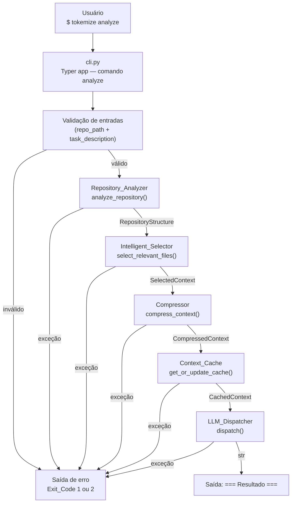

# Design Document — Tokemize CLI

## Overview

A CLI do Tokemize é o ponto de entrada do sistema para o usuário final. Implementada com [Typer](https://typer.tiangolo.com/) sobre Python 3.11+, ela expõe o subcomando `analyze` que recebe um caminho de repositório e uma descrição de tarefa, valida as entradas e orquestra um pipeline de cinco etapas sequenciais:

1. **Repository_Analyzer** — mapeia a estrutura do repositório
2. **Intelligent_Selector** — seleciona os arquivos relevantes para a tarefa
3. **Compressor** — resume e comprime o contexto selecionado
4. **Context_Cache** — verifica/atualiza o cache de contexto
5. **LLM_Dispatcher** — envia a requisição otimizada ao LLM e retorna a resposta

A CLI **não implementa lógica de negócio**; ela define os contratos de interface com cada módulo interno e exibe feedback de progresso ao usuário durante a execução.

### Objetivos de design

- Separação clara entre camada de apresentação (CLI) e lógica de negócio (módulos `tokemize/`)
- Validação de entradas antes de qualquer chamada ao pipeline
- Mensagens de erro determinísticas e legíveis por humanos
- Exit codes padronizados para integração com scripts e CI/CD
- Tipagem estática completa em todas as funções e classes

---

## Architecture



### Decisões de design

| Decisão | Rationale |
|---|---|
| Typer como framework CLI | Geração automática de `--help`, tipagem nativa via type hints, integração com Click |
| Validação antes do pipeline | Falha rápida — evita inicializar módulos pesados com entradas inválidas |
| Exit codes 0/1/2 | Convenção POSIX: 0 = sucesso, 1 = erro de entrada, 2 = erro de execução |
| Módulos importados de `tokemize/` | Encapsulamento — a CLI não conhece detalhes de implementação dos módulos |
| Mensagens de progresso `[N/5]` | Feedback imediato ao usuário sem depender de logging estruturado |

---

## Components and Interfaces

### `cli.py` — Entrypoint

```python
import typer
from tokemize.core.parser.repository_analyzer import analyze_repository
from tokemize.core.selector.intelligent_selector import select_relevant_files
from tokemize.core.optimizer.compressor import compress_context
from tokemize.core.context_cache import get_or_update_cache
from tokemize.integrations.llm.llm_dispatcher import dispatch

app = typer.Typer()

@app.command()
def analyze(
    repo_path: str = typer.Argument(..., help="Caminho para o repositório a ser analisado"),
    task_description: str = typer.Argument(..., help="Descrição da tarefa técnica (mínimo 10 caracteres)"),
) -> None:
    """Analisa um repositório e envia uma requisição otimizada ao LLM."""
    ...
```

**Responsabilidades:**
- Instanciar `typer.Typer()` e registrar o comando `analyze`
- Executar validação de `repo_path` e `task_description`
- Exibir mensagens de progresso `[N/5]` antes de cada etapa
- Capturar exceções de cada módulo e exibir mensagem padronizada
- Encerrar com o Exit_Code correto via `raise typer.Exit(code=N)`

### Módulos internos (contratos de interface)

Cada módulo expõe **uma única função pública** com assinatura tipada:

| Módulo | Função | Entrada | Saída |
|---|---|---|---|
| `tokemize.core.parser.repository_analyzer` | `analyze_repository` | `repo_path: str` | `RepositoryStructure` |
| `tokemize.core.selector.intelligent_selector` | `select_relevant_files` | `structure: RepositoryStructure, task_description: str` | `SelectedContext` |
| `tokemize.core.optimizer.compressor` | `compress_context` | `context: SelectedContext` | `CompressedContext` |
| `tokemize.core.context_cache` | `get_or_update_cache` | `compressed: CompressedContext, task_description: str` | `CachedContext` |
| `tokemize.integrations.llm.llm_dispatcher` | `dispatch` | `cached_context: CachedContext` | `str` |

### Validação de entradas

```python
def _validate_repo_path(repo_path: str) -> None:
    """Valida existência e tipo do caminho do repositório.
    
    Args:
        repo_path: Caminho fornecido pelo usuário.
        
    Raises:
        typer.Exit: Com código 1 em caso de caminho inválido.
    """
    path = Path(repo_path)
    if not path.exists():
        typer.echo(f"Erro: o caminho '{repo_path}' não existe.")
        raise typer.Exit(code=1)
    if not path.is_dir():
        typer.echo(f"Erro: '{repo_path}' não é um diretório válido.")
        raise typer.Exit(code=1)


def _validate_task_description(task_description: str) -> None:
    """Valida conteúdo e comprimento mínimo da descrição da tarefa.
    
    Args:
        task_description: Descrição fornecida pelo usuário.
        
    Raises:
        typer.Exit: Com código 1 em caso de descrição inválida.
    """
    stripped = task_description.strip()
    if not stripped:
        typer.echo("Erro: a descrição da tarefa não pode ser vazia.")
        raise typer.Exit(code=1)
    non_whitespace = len(stripped.replace(" ", "").replace("\t", "").replace("\n", ""))
    if non_whitespace < 10:
        typer.echo("Erro: a descrição da tarefa deve ter pelo menos 10 caracteres.")
        raise typer.Exit(code=1)
```

### Tratamento de erros do pipeline

```python
def _run_step(step_name: str, fn: Callable, *args: Any) -> Any:
    """Executa uma etapa do pipeline com tratamento de exceções padronizado.
    
    Args:
        step_name: Nome legível da etapa para mensagens de erro.
        fn: Função a ser executada.
        *args: Argumentos posicionais para a função.
        
    Returns:
        Resultado da função.
        
    Raises:
        typer.Exit: Com código 2 em caso de exceção.
    """
    try:
        return fn(*args)
    except Exception as exc:
        typer.echo(f"Erro na etapa '{step_name}': {exc}")
        raise typer.Exit(code=2)
```

---

## Data Models

Todos os modelos são definidos em `tokemize/models/` como dataclasses com tipagem estática.

```python
# tokemize/models/__init__.py
from dataclasses import dataclass, field
from typing import Any


@dataclass
class FileInfo:
    """Informações sobre um arquivo do repositório.
    
    Attributes:
        path: Caminho relativo ao repositório.
        language: Linguagem de programação detectada.
        size_bytes: Tamanho do arquivo em bytes.
    """
    path: str
    language: str
    size_bytes: int


@dataclass
class RepositoryStructure:
    """Estrutura mapeada do repositório pelo Repository_Analyzer.
    
    Attributes:
        root_path: Caminho absoluto da raiz do repositório.
        files: Lista de arquivos encontrados.
        metadata: Metadados adicionais do repositório.
    """
    root_path: str
    files: list[FileInfo] = field(default_factory=list)
    metadata: dict[str, Any] = field(default_factory=dict)


@dataclass
class SelectedContext:
    """Contexto selecionado pelo Intelligent_Selector.
    
    Attributes:
        task_description: Descrição da tarefa original.
        selected_files: Arquivos selecionados como relevantes.
        relevance_scores: Pontuação de relevância por arquivo.
    """
    task_description: str
    selected_files: list[FileInfo] = field(default_factory=list)
    relevance_scores: dict[str, float] = field(default_factory=dict)


@dataclass
class CompressedContext:
    """Contexto comprimido pelo Compressor.
    
    Attributes:
        task_description: Descrição da tarefa original.
        compressed_content: Conteúdo comprimido/resumido.
        token_count: Estimativa de tokens do conteúdo comprimido.
    """
    task_description: str
    compressed_content: str
    token_count: int


@dataclass
class CachedContext:
    """Contexto verificado/atualizado pelo Context_Cache.
    
    Attributes:
        task_description: Descrição da tarefa original.
        content: Conteúdo final a ser enviado ao LLM.
        cache_hit: Indica se o resultado veio do cache.
        token_count: Estimativa de tokens do conteúdo.
    """
    task_description: str
    content: str
    cache_hit: bool
    token_count: int
```

### Fluxo de dados pelo pipeline

```
str (repo_path)
    └─► RepositoryStructure
            └─► SelectedContext
                    └─► CompressedContext
                            └─► CachedContext
                                    └─► str (resposta LLM)
```

---

## Correctness Properties

*A property is a characteristic or behavior that should hold true across all valid executions of a system — essentially, a formal statement about what the system should do. Properties serve as the bridge between human-readable specifications and machine-verifiable correctness guarantees.*

### Property 1: Caminhos inexistentes são sempre rejeitados com Exit_Code 1

*Para qualquer* string que não corresponda a um caminho existente no sistema de arquivos, a CLI SHALL encerrar com Exit_Code 1 e exibir uma mensagem de erro contendo o caminho fornecido.

**Validates: Requirements 2.1**

---

### Property 2: Arquivos (não-diretórios) são sempre rejeitados com Exit_Code 1

*Para qualquer* caminho existente no sistema de arquivos que não seja um diretório, a CLI SHALL encerrar com Exit_Code 1 e exibir uma mensagem de erro contendo o caminho fornecido.

**Validates: Requirements 2.2**

---

### Property 3: Strings de whitespace puro são sempre rejeitadas como task_description

*Para qualquer* string composta exclusivamente de caracteres whitespace (incluindo a string vazia), a CLI SHALL encerrar com Exit_Code 1 e exibir a mensagem `"Erro: a descrição da tarefa não pode ser vazia."`.

**Validates: Requirements 3.1**

---

### Property 4: Descrições com menos de 10 caracteres não-brancos são sempre rejeitadas

*Para qualquer* string com entre 1 e 9 caracteres não-brancos (independentemente de whitespace intercalado), a CLI SHALL encerrar com Exit_Code 1 e exibir a mensagem `"Erro: a descrição da tarefa deve ter pelo menos 10 caracteres."`.

**Validates: Requirements 3.2**

---

### Property 5: Descrições válidas nunca são bloqueadas pela validação

*Para qualquer* string com 10 ou mais caracteres não-brancos, a validação de `task_description` SHALL passar sem encerrar com Exit_Code 1 por motivo de validação de entrada.

**Validates: Requirements 3.3**

---

### Property 6: Exceções do pipeline sempre produzem Exit_Code 2 com mensagem contendo nome do módulo e mensagem da exceção

*Para qualquer* módulo do pipeline e *para qualquer* mensagem de exceção lançada por esse módulo, a CLI SHALL encerrar com Exit_Code 2 e exibir uma mensagem de saída contendo o nome do módulo e a mensagem da exceção original.

**Validates: Requirements 4.6**

---

### Property 7: O resultado do LLM é sempre exibido precedido do cabeçalho correto

*Para qualquer* string retornada pelo `LLM_Dispatcher`, a CLI SHALL exibir essa string na saída padrão precedida da linha `"=== Resultado ==="`.

**Validates: Requirements 5.6**

---

## Error Handling

### Categorias de erro

| Categoria | Exit_Code | Origem | Mensagem |
|---|---|---|---|
| Caminho inexistente | 1 | Validação de `repo_path` | `"Erro: o caminho '<repo_path>' não existe."` |
| Caminho não é diretório | 1 | Validação de `repo_path` | `"Erro: '<repo_path>' não é um diretório válido."` |
| Descrição vazia | 1 | Validação de `task_description` | `"Erro: a descrição da tarefa não pode ser vazia."` |
| Descrição muito curta | 1 | Validação de `task_description` | `"Erro: a descrição da tarefa deve ter pelo menos 10 caracteres."` |
| Falha no pipeline | 2 | Qualquer módulo interno | `"Erro na etapa '<nome_do_módulo>': <mensagem_da_exceção>"` |

### Estratégia de tratamento

- **Validação de entradas**: executada antes de qualquer chamada ao pipeline. Usa `typer.Exit(code=1)` para encerrar imediatamente após exibir a mensagem de erro.
- **Erros do pipeline**: capturados por `_run_step()` via `except Exception`. O nome do módulo é passado como parâmetro estático para garantir mensagens determinísticas. Usa `typer.Exit(code=2)`.
- **Erros inesperados fora do pipeline**: não capturados explicitamente — propagam como exceções Python não tratadas (stack trace visível ao usuário). Isso é intencional para facilitar debugging durante desenvolvimento.

### Nomes dos módulos nas mensagens de erro

Os nomes usados nas mensagens de erro do pipeline são strings literais definidas na CLI:

```python
STEP_NAMES = {
    "repository_analyzer": "Repository_Analyzer",
    "intelligent_selector": "Intelligent_Selector",
    "compressor": "Compressor",
    "context_cache": "Context_Cache",
    "llm_dispatcher": "LLM_Dispatcher",
}
```

---

## Testing Strategy

### Abordagem dual

A estratégia combina testes de exemplo (unit tests) para comportamentos específicos e determinísticos, e testes baseados em propriedades (property-based tests) para comportamentos universais que devem valer para qualquer input.

### Biblioteca de property-based testing

**[Hypothesis](https://hypothesis.readthedocs.io/)** — biblioteca padrão para PBT em Python.

```
pip install hypothesis
# ou
poetry add --group dev hypothesis
```

Cada property test deve rodar com mínimo de **100 iterações** (padrão do Hypothesis).

### Testes de exemplo (pytest)

Focados em comportamentos determinísticos e verificações de configuração:

- **Smoke tests** (`tests/test_cli_smoke.py`):
  - Verificar que o comando `analyze` está registrado na aplicação Typer
  - Verificar assinaturas das funções dos módulos internos via `inspect`
  - Verificar existência dos arquivos e diretórios do projeto

- **Example tests** (`tests/test_cli_examples.py`):
  - Invocar `analyze` sem argumentos → Exit_Code 0 + texto de ajuda
  - Invocar `analyze --help` → Exit_Code 0 + descrições dos argumentos
  - Verificar mensagens de progresso `[1/5]` a `[5/5]` na saída (com mocks)
  - Verificar ordem de chamada dos módulos do pipeline (com mocks)

### Testes baseados em propriedades (Hypothesis)

Arquivo: `tests/test_cli_properties.py`

```python
from hypothesis import given, settings
from hypothesis import strategies as st
from typer.testing import CliRunner
from cli import app

runner = CliRunner()

# Feature: tokemize-cli, Property 1: Caminhos inexistentes são sempre rejeitados
@given(st.text(min_size=1).filter(lambda p: not Path(p).exists()))
@settings(max_examples=100)
def test_nonexistent_path_exits_with_code_1(nonexistent_path):
    result = runner.invoke(app, ["analyze", nonexistent_path, "descrição válida com dez chars"])
    assert result.exit_code == 1
    assert nonexistent_path in result.output

# Feature: tokemize-cli, Property 2: Arquivos (não-diretórios) são sempre rejeitados
@given(st.text(min_size=1, alphabet=st.characters(blacklist_categories=("Cs",))))
@settings(max_examples=100)
def test_file_path_exits_with_code_1(filename):
    # Cria arquivo temporário e verifica rejeição
    ...

# Feature: tokemize-cli, Property 3: Strings de whitespace puro são sempre rejeitadas
@given(st.text(alphabet=" \t\n\r", min_size=0))
@settings(max_examples=100)
def test_whitespace_task_description_rejected(whitespace_str):
    with tmp_dir() as repo:
        result = runner.invoke(app, ["analyze", str(repo), whitespace_str])
        assert result.exit_code == 1
        assert "não pode ser vazia" in result.output

# Feature: tokemize-cli, Property 4: Descrições com menos de 10 chars não-brancos são rejeitadas
@given(st.text(min_size=1, max_size=9).filter(lambda s: len(s.strip()) >= 1))
@settings(max_examples=100)
def test_short_task_description_rejected(short_desc):
    # Garante que tem 1-9 chars não-brancos
    ...

# Feature: tokemize-cli, Property 5: Descrições válidas nunca são bloqueadas
@given(st.text(min_size=10).filter(lambda s: len(s.replace(" ","").replace("\t","").replace("\n","")) >= 10))
@settings(max_examples=100)
def test_valid_task_description_passes_validation(valid_desc):
    # Com mocks do pipeline, verificar que não encerra com Exit_Code 1 por validação
    ...

# Feature: tokemize-cli, Property 6: Exceções do pipeline produzem Exit_Code 2
@given(st.sampled_from(MODULE_NAMES), st.text(min_size=1))
@settings(max_examples=100)
def test_pipeline_exception_exits_with_code_2(module_name, error_message):
    # Mock do módulo para lançar Exception(error_message)
    # Verificar Exit_Code 2 e presença do nome do módulo e mensagem na saída
    ...

# Feature: tokemize-cli, Property 7: Resultado do LLM sempre exibido com cabeçalho
@given(st.text())
@settings(max_examples=100)
def test_llm_result_displayed_with_header(llm_response):
    # Mock do pipeline completo, LLM_Dispatcher retorna llm_response
    # Verificar "=== Resultado ===" e llm_response na saída
    ...
```

### Cobertura esperada

| Requisito | Tipo de teste | Arquivo |
|---|---|---|
| 1.1-1.3 (registro do comando) | Smoke | `test_cli_smoke.py` |
| 1.4-1.5 (--help) | Example | `test_cli_examples.py` |
| 2.1 (caminho inexistente) | Property | `test_cli_properties.py` |
| 2.2 (não é diretório) | Property | `test_cli_properties.py` |
| 3.1 (whitespace puro) | Property | `test_cli_properties.py` |
| 3.2 (menos de 10 chars) | Property | `test_cli_properties.py` |
| 3.3 (descrição válida passa) | Property | `test_cli_properties.py` |
| 4.1-4.5 (ordem do pipeline) | Example | `test_cli_examples.py` |
| 4.6 (exceções do pipeline) | Property | `test_cli_properties.py` |
| 5.1-5.5 (mensagens de progresso) | Example | `test_cli_examples.py` |
| 5.6 (exibição do resultado) | Property | `test_cli_properties.py` |
| 6.1-6.6 (contratos de interface) | Smoke | `test_cli_smoke.py` |
| 7.1-7.4 (estrutura de arquivos) | Smoke | `test_cli_smoke.py` |
