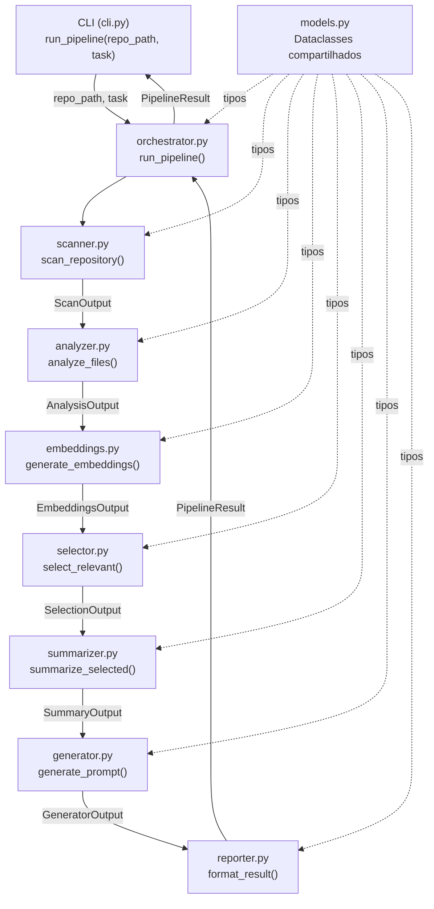
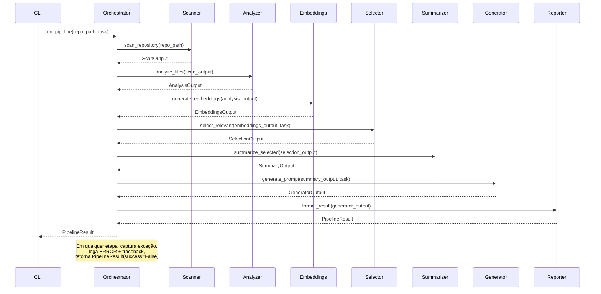
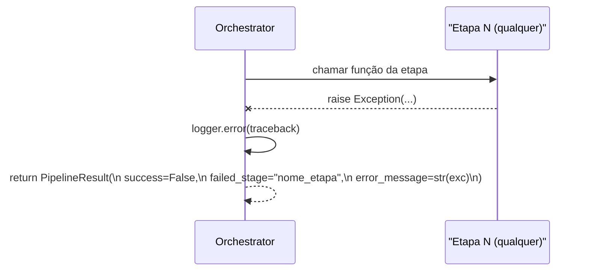
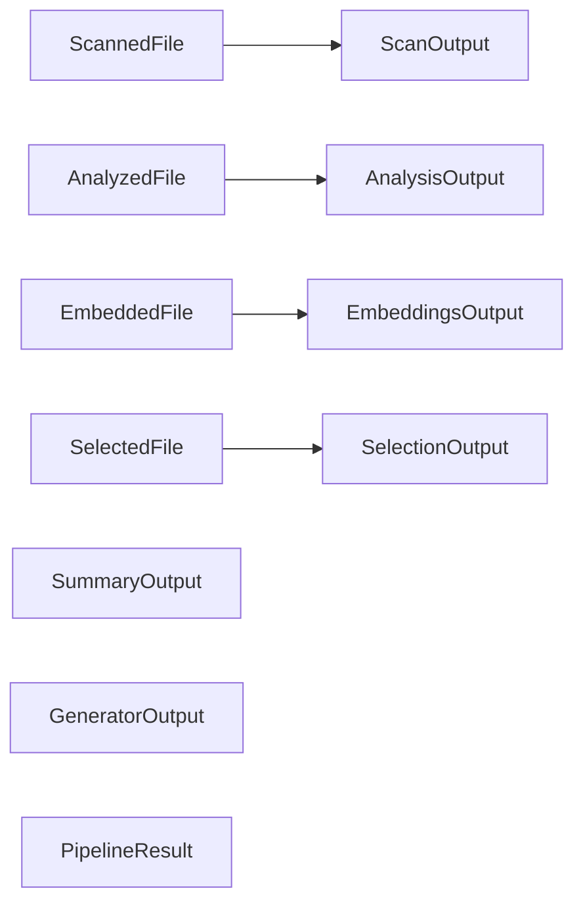

# Design Document: tokemize-orchestrator

## Overview

O módulo `tokemize/orchestrator.py` é o núcleo de coordenação do Tokemize. Ele expõe a função pública `run_pipeline(repo_path, task)` que a CLI chama para executar o pipeline completo de otimização de contexto para LLMs. O orquestrador é responsável por invocar cada etapa na ordem correta, propagar os dados entre elas, capturar falhas com logging estruturado e retornar um `PipelineResult` com o resultado final e metadados de execução.

O design segue o princípio de separação de responsabilidades: o orquestrador não contém lógica de negócio — apenas coordena. Cada módulo de etapa é substituível por uma implementação real sem alterar o orquestrador, graças a contratos de interface bem definidos e stubs funcionais desde o início.

---

## Arquitetura

### Visão Geral do Sistema



### Fluxo de Dados Sequencial



### Fluxo de Erro



---

## Estrutura de Arquivos

```
tokemize/
├── orchestrator.py   ← módulo principal (run_pipeline)
├── models.py         ← dataclasses e tipos compartilhados
├── scanner.py        ← stub: scan_repository()
├── analyzer.py       ← stub: analyze_files()
├── embeddings.py     ← stub: generate_embeddings()
├── selector.py       ← stub: select_relevant()
├── summarizer.py     ← stub: summarize_selected()
├── generator.py      ← stub: generate_prompt()
└── reporter.py       ← stub: format_result()
```

> **Nota de coexistência:** O pacote `tokemize/` na raiz do projeto é distinto de `src/tokemize/`. O orquestrador especificado aqui reside em `tokemize/orchestrator.py` (raiz), alinhado com a chamada da CLI existente (`from tokemize.orchestrator import run_pipeline`).

---

## Componentes e Interfaces

### Orchestrator (`tokemize/orchestrator.py`)

**Propósito:** Coordenar a execução sequencial das 7 etapas do pipeline, propagar dados entre elas, capturar falhas e retornar `PipelineResult`.

**Interface pública:**
```python
def run_pipeline(repo_path: str, task: str) -> PipelineResult: ...
```

**Responsabilidades:**
- Validar que `repo_path` é uma string não-vazia (a validação de existência do diretório é responsabilidade da CLI)
- Invocar cada etapa na ordem correta, passando o output da anterior como input da próxima
- Registrar `INFO` no início e fim de cada etapa
- Capturar qualquer `Exception` em qualquer etapa, registrar `ERROR` com traceback e retornar `PipelineResult` com `success=False`
- Registrar o tempo total de execução em `PipelineResult.elapsed_seconds`

---

### Scanner (`tokemize/scanner.py`)

**Propósito:** Percorrer o repositório e listar os arquivos existentes com metadados básicos.

**Interface:**
```python
def scan_repository(repo_path: str) -> ScanOutput: ...
```

**Entrada:** `repo_path: str` — caminho absoluto ou relativo para a raiz do repositório.

**Saída:** `ScanOutput` — lista de arquivos encontrados com metadados (caminho, extensão, tamanho, linguagem).

**Em caso de erro ou dado vazio:** Retorna `ScanOutput(files=[], total_files=0, skipped_files=0)` se o diretório estiver vazio ou inacessível. Lança `NotADirectoryError` se `repo_path` não for um diretório válido.

---

### Analyzer (`tokemize/analyzer.py`)

**Propósito:** Analisar a estrutura dos arquivos encontrados pelo scanner e classificá-los por tipo e relevância potencial.

**Interface:**
```python
def analyze_files(scan_output: ScanOutput) -> AnalysisOutput: ...
```

**Entrada:** `ScanOutput` — resultado do scanner com lista de arquivos.

**Saída:** `AnalysisOutput` — lista de arquivos enriquecidos com tipo, artefatos extraídos e score de relevância potencial.

**Em caso de erro ou dado vazio:** Se `scan_output.files` estiver vazio, retorna `AnalysisOutput(analyzed_files=[])`. Arquivos individuais que falham na análise são ignorados (logados como WARNING) e não interrompem o processamento dos demais.

---

### Embeddings (`tokemize/embeddings.py`)

**Propósito:** Gerar representações vetoriais (embeddings) dos arquivos analisados para permitir busca por similaridade semântica.

**Interface:**
```python
def generate_embeddings(analysis_output: AnalysisOutput) -> EmbeddingsOutput: ...
```

**Entrada:** `AnalysisOutput` — arquivos analisados com conteúdo e metadados.

**Saída:** `EmbeddingsOutput` — lista de arquivos com seus vetores de embedding associados.

**Em caso de erro ou dado vazio:** Se `analysis_output.analyzed_files` estiver vazio, retorna `EmbeddingsOutput(embedded_files=[])`. Falhas na geração de embedding de um arquivo individual são logadas como WARNING; o arquivo é incluído com `embedding=[]`.

---

### Selector (`tokemize/selector.py`)

**Propósito:** Selecionar os arquivos mais relevantes para a tarefa informada, usando similaridade semântica entre os embeddings dos arquivos e o embedding da tarefa.

**Interface:**
```python
def select_relevant(embeddings_output: EmbeddingsOutput, task: str) -> SelectionOutput: ...
```

**Entrada:** `EmbeddingsOutput` + `task: str` — arquivos com embeddings e descrição da tarefa.

**Saída:** `SelectionOutput` — lista de arquivos selecionados com scores de relevância, ordenados por relevância decrescente.

**Em caso de erro ou dado vazio:** Se `embeddings_output.embedded_files` estiver vazio ou nenhum arquivo atingir o limiar mínimo de relevância, retorna `SelectionOutput(selected_files=[])`.

---

### Summarizer (`tokemize/summarizer.py`)

**Propósito:** Resumir e comprimir o conteúdo dos arquivos selecionados para caber no budget de contexto do LLM.

**Interface:**
```python
def summarize_selected(selection_output: SelectionOutput) -> SummaryOutput: ...
```

**Entrada:** `SelectionOutput` — arquivos selecionados com conteúdo e scores.

**Saída:** `SummaryOutput` — conteúdo resumido com estimativa de tokens.

**Em caso de erro ou dado vazio:** Se `selection_output.selected_files` estiver vazio, retorna `SummaryOutput(summarized_content="", token_count=0)`.

---

### Generator (`tokemize/generator.py`)

**Propósito:** Montar o prompt final otimizado combinando o contexto resumido com a descrição da tarefa.

**Interface:**
```python
def generate_prompt(summary_output: SummaryOutput, task: str) -> GeneratorOutput: ...
```

**Entrada:** `SummaryOutput` + `task: str` — contexto resumido e descrição da tarefa.

**Saída:** `GeneratorOutput` — prompt final formatado e pronto para envio ao LLM.

**Em caso de erro ou dado vazio:** Se `summary_output.summarized_content` estiver vazio, retorna `GeneratorOutput(prompt=task, token_count=0)` — o prompt mínimo é a própria tarefa.

---

### Reporter (`tokemize/reporter.py`)

**Propósito:** Formatar e estruturar o resultado final para retorno à CLI.

**Interface:**
```python
def format_result(generator_output: GeneratorOutput) -> PipelineResult: ...
```

**Entrada:** `GeneratorOutput` — prompt final gerado.

**Saída:** `PipelineResult` — resultado completo com prompt, metadados e status de sucesso.

**Em caso de erro ou dado vazio:** Nunca lança exceção. Se `generator_output.prompt` estiver vazio, retorna `PipelineResult` com `success=True` e `prompt=""`.

---

## Modelos de Dados (`tokemize/models.py`)

### Hierarquia de tipos



### Definições completas

```python
# tokemize/models.py

from __future__ import annotations
from dataclasses import dataclass, field
from typing import Optional


# ── Scanner ──────────────────────────────────────────────────────────────────

@dataclass
class ScannedFile:
    """Metadados de um arquivo encontrado pelo scanner."""
    path: str                    # caminho relativo à raiz do repositório
    absolute_path: str           # caminho absoluto
    language: str                # "python", "java", "javascript", "typescript", "unknown"
    extension: str               # ".py", ".java", etc.
    size_bytes: int
    line_count: int


@dataclass
class ScanOutput:
    """Resultado da etapa de varredura do repositório."""
    repo_path: str
    files: list[ScannedFile] = field(default_factory=list)
    total_files: int = 0
    skipped_files: int = 0


# ── Analyzer ─────────────────────────────────────────────────────────────────

@dataclass
class AnalyzedFile:
    """Arquivo enriquecido com análise estrutural."""
    path: str
    language: str
    size_bytes: int
    line_count: int
    file_type: str               # "source", "config", "test", "doc", "unknown"
    artifact_count: int          # número de funções/classes extraídas
    content: str                 # conteúdo textual do arquivo
    relevance_hint: float        # score heurístico [0.0, 1.0] antes dos embeddings


@dataclass
class AnalysisOutput:
    """Resultado da etapa de análise estrutural."""
    analyzed_files: list[AnalyzedFile] = field(default_factory=list)
    total_analyzed: int = 0
    total_skipped: int = 0


# ── Embeddings ───────────────────────────────────────────────────────────────

@dataclass
class EmbeddedFile:
    """Arquivo com vetor de embedding gerado."""
    path: str
    language: str
    content: str
    embedding: list[float] = field(default_factory=list)  # vazio se falhou


@dataclass
class EmbeddingsOutput:
    """Resultado da etapa de geração de embeddings."""
    embedded_files: list[EmbeddedFile] = field(default_factory=list)
    total_embedded: int = 0
    total_failed: int = 0


# ── Selector ─────────────────────────────────────────────────────────────────

@dataclass
class SelectedFile:
    """Arquivo selecionado com score de relevância."""
    path: str
    language: str
    content: str
    relevance_score: float       # similaridade coseno [0.0, 1.0]


@dataclass
class SelectionOutput:
    """Resultado da etapa de seleção de arquivos relevantes."""
    task: str = ""
    selected_files: list[SelectedFile] = field(default_factory=list)
    total_candidates: int = 0


# ── Summarizer ───────────────────────────────────────────────────────────────

@dataclass
class SummaryOutput:
    """Resultado da etapa de sumarização e compressão."""
    summarized_content: str = ""
    token_count: int = 0
    files_summarized: int = 0


# ── Generator ────────────────────────────────────────────────────────────────

@dataclass
class GeneratorOutput:
    """Resultado da etapa de geração do prompt final."""
    prompt: str = ""
    token_count: int = 0


# ── Pipeline Result ──────────────────────────────────────────────────────────

@dataclass
class PipelineResult:
    """Resultado completo da execução do pipeline.

    Attributes:
        success: True se todas as etapas foram concluídas sem erro.
        prompt: Prompt final gerado (vazio em caso de falha).
        failed_stage: Nome da etapa que falhou, ou None se sucesso.
        error_message: Mensagem de erro, ou None se sucesso.
        elapsed_seconds: Tempo total de execução do pipeline.
        stages_completed: Lista de etapas concluídas com sucesso.
    """
    success: bool = False
    prompt: str = ""
    failed_stage: Optional[str] = None
    error_message: Optional[str] = None
    elapsed_seconds: float = 0.0
    stages_completed: list[str] = field(default_factory=list)
```

---

## Algoritmos e Especificações Formais

### Algoritmo Principal: `run_pipeline`

```python
ALGORITHM run_pipeline(repo_path: str, task: str) -> PipelineResult
INPUT:
  repo_path — caminho para a raiz do repositório
  task      — descrição textual da tarefa técnica
OUTPUT:
  PipelineResult com success=True e prompt preenchido,
  ou success=False com failed_stage e error_message

PRECONDITIONS:
  - repo_path é uma string não-vazia
  - task é uma string não-vazia

POSTCONDITIONS:
  - Se success=True: prompt != "" e failed_stage is None
  - Se success=False: failed_stage in PIPELINE_STAGES e error_message != ""
  - elapsed_seconds >= 0.0
  - len(stages_completed) <= len(PIPELINE_STAGES)

BEGIN
  start_time ← time.perf_counter()
  stages_completed ← []

  PIPELINE_STAGES ← [
    ("scanner",    scan_repository,     [repo_path]),
    ("analyzer",   analyze_files,       [prev_output]),
    ("embeddings", generate_embeddings, [prev_output]),
    ("selector",   select_relevant,     [prev_output, task]),
    ("summarizer", summarize_selected,  [prev_output]),
    ("generator",  generate_prompt,     [prev_output, task]),
    ("reporter",   format_result,       [prev_output]),
  ]

  current_output ← None

  FOR each (stage_name, stage_fn, stage_args) IN PIPELINE_STAGES DO
    -- LOOP INVARIANT: stages_completed contém apenas etapas bem-sucedidas
    -- LOOP INVARIANT: current_output é o output válido da última etapa concluída

    logger.info("Iniciando etapa: %s", stage_name)

    TRY
      current_output ← stage_fn(*stage_args_resolved(stage_args, current_output))
      stages_completed.append(stage_name)
      logger.info("Etapa concluída: %s", stage_name)

    EXCEPT Exception AS exc
      logger.error("Falha na etapa '%s': %s", stage_name, exc, exc_info=True)
      elapsed ← time.perf_counter() - start_time
      RETURN PipelineResult(
        success=False,
        failed_stage=stage_name,
        error_message=str(exc),
        elapsed_seconds=elapsed,
        stages_completed=stages_completed,
      )
    END TRY
  END FOR

  -- current_output é PipelineResult retornado pelo reporter
  result ← current_output
  result.elapsed_seconds ← time.perf_counter() - start_time
  result.stages_completed ← stages_completed
  RETURN result
END
```

**Precondições:**
- `repo_path` é string não-vazia
- `task` é string não-vazia

**Pós-condições:**
- Sempre retorna `PipelineResult` (nunca propaga exceção)
- `success=True` implica `failed_stage is None` e `prompt != ""`
- `success=False` implica `failed_stage` é um dos nomes de etapa válidos
- `elapsed_seconds >= 0.0`
- `stages_completed` é subconjunto ordenado de `PIPELINE_STAGES`

**Invariante de loop:**
- `stages_completed` contém exatamente as etapas concluídas sem erro até o momento
- `current_output` é sempre o output tipado correto da última etapa bem-sucedida

---

### Algoritmo de Resolução de Argumentos

```python
ALGORITHM _resolve_stage_args(stage_name, prev_output, task) -> list
INPUT:
  stage_name  — nome da etapa atual
  prev_output — output da etapa anterior (None na primeira etapa)
  task        — descrição da tarefa (passada diretamente ao selector e generator)
OUTPUT:
  lista de argumentos posicionais para a função da etapa

BEGIN
  IF stage_name == "scanner" THEN
    RETURN [repo_path]                        -- usa repo_path do escopo externo
  ELSE IF stage_name IN ["selector", "generator"] THEN
    RETURN [prev_output, task]                -- recebem também a task
  ELSE
    RETURN [prev_output]                      -- demais etapas recebem só o output anterior
  END IF
END
```

---

## Estratégia de Stubs

Cada módulo de etapa deve ter uma implementação stub que:
1. Aceita os tipos de entrada corretos
2. Retorna o tipo de saída correto com dados fictícios mas estruturalmente válidos
3. Não usa `unittest.mock` — apenas funções Python simples
4. É substituível pela implementação real sem alterar o orquestrador

### Exemplo de stub (scanner)

```python
# tokemize/scanner.py — stub funcional

from tokemize.models import ScanOutput, ScannedFile

def scan_repository(repo_path: str) -> ScanOutput:
    """Stub: retorna um arquivo fictício para validar o pipeline ponta a ponta."""
    stub_file = ScannedFile(
        path="src/main.py",
        absolute_path=f"{repo_path}/src/main.py",
        language="python",
        extension=".py",
        size_bytes=1024,
        line_count=42,
    )
    return ScanOutput(
        repo_path=repo_path,
        files=[stub_file],
        total_files=1,
        skipped_files=0,
    )
```

O mesmo padrão se aplica a todos os outros módulos: cada stub retorna uma instância válida do seu tipo de saída com dados fictícios mas coerentes.

---

## Tratamento de Erros

### Cenários de Falha

| Cenário | Etapa | Comportamento |
|---|---|---|
| Diretório não existe | scanner | `NotADirectoryError` capturada → `PipelineResult(success=False, failed_stage="scanner")` |
| Arquivo ilegível | analyzer | WARNING logado, arquivo ignorado; pipeline continua |
| API de embeddings indisponível | embeddings | `Exception` capturada → `PipelineResult(success=False, failed_stage="embeddings")` |
| Nenhum arquivo relevante | selector | Retorna `SelectionOutput(selected_files=[])` → pipeline continua com conteúdo vazio |
| LLM indisponível (futuro) | generator | `Exception` capturada → `PipelineResult(success=False, failed_stage="generator")` |
| Erro inesperado em qualquer etapa | qualquer | `Exception` capturada → `PipelineResult(success=False, failed_stage=<etapa>)` |

### Política de Logging

```python
# Início de etapa
logger.info("Iniciando etapa: %s", stage_name)

# Conclusão de etapa
logger.info("Etapa concluída: %s | tempo=%.3fs", stage_name, elapsed)

# Falha em etapa (com traceback completo)
logger.error(
    "Falha na etapa '%s': %s",
    stage_name,
    exc,
    exc_info=True,   # inclui traceback
)

# Aviso em arquivo individual (dentro de uma etapa)
logger.warning("Arquivo ignorado '%s': %s", file_path, reason)
```

---

## Estratégia de Testes

### Testes Unitários

- `test_run_pipeline_success`: pipeline completo com todos os stubs retorna `PipelineResult(success=True)`
- `test_run_pipeline_fails_at_scanner`: scanner lança exceção → `failed_stage="scanner"`, `success=False`
- `test_run_pipeline_fails_at_each_stage`: parametrizado para cada uma das 7 etapas
- `test_stages_completed_on_partial_failure`: `stages_completed` contém apenas as etapas anteriores à falha
- `test_elapsed_seconds_is_positive`: `elapsed_seconds > 0` após execução
- `test_pipeline_result_on_empty_repo`: scanner retorna lista vazia → pipeline conclui com `success=True` e `prompt` vazio ou mínimo

### Testes de Propriedade (Hypothesis)

- **Propriedade 1:** Para qualquer `repo_path` e `task` válidos, `run_pipeline` sempre retorna um `PipelineResult` (nunca propaga exceção)
- **Propriedade 2:** Se `success=True`, então `failed_stage is None` e `error_message is None`
- **Propriedade 3:** Se `success=False`, então `failed_stage` é um dos nomes de etapa válidos
- **Propriedade 4:** `len(stages_completed) <= 7` sempre
- **Propriedade 5:** `elapsed_seconds >= 0.0` sempre

### Testes de Integração

- Pipeline ponta a ponta com stubs: verifica que todos os tipos de dados fluem corretamente entre as etapas
- Substituição de stub por implementação real em uma etapa: verifica que o orquestrador não precisa ser alterado

---

## Considerações de Performance

- O orquestrador é sequencial por design — não há paralelismo entre etapas, pois cada uma depende do output da anterior
- O tempo de execução dominante será a etapa de `embeddings` (chamada de API) e `summarizer` (chamada de LLM)
- `elapsed_seconds` é medido com `time.perf_counter()` para alta resolução
- Stubs têm latência próxima de zero, permitindo testes rápidos do pipeline completo

---

## Considerações de Segurança

- `repo_path` não deve ser usado em chamadas de shell — apenas como argumento para `pathlib.Path`
- Credenciais de API (OpenAI, Anthropic) nunca devem ser passadas pelo orquestrador; são responsabilidade das camadas de integração via `python-dotenv`
- O orquestrador não lê nem escreve arquivos diretamente — delega ao scanner e demais módulos

---

## Dependências

| Dependência | Uso | Origem |
|---|---|---|
| `logging` | Logging estruturado | stdlib Python |
| `time` | Medição de tempo (`perf_counter`) | stdlib Python |
| `dataclasses` | Modelos de dados | stdlib Python |
| `tokemize.models` | Tipos compartilhados entre etapas | interno |
| `tokemize.scanner` | Etapa 1: varredura | interno (stub → real) |
| `tokemize.analyzer` | Etapa 2: análise estrutural | interno (stub → real) |
| `tokemize.embeddings` | Etapa 3: geração de embeddings | interno (stub → real) |
| `tokemize.selector` | Etapa 4: seleção por relevância | interno (stub → real) |
| `tokemize.summarizer` | Etapa 5: sumarização | interno (stub → real) |
| `tokemize.generator` | Etapa 6: geração de prompt | interno (stub → real) |
| `tokemize.reporter` | Etapa 7: formatação do resultado | interno (stub → real) |

---

## Correctness Properties

*A property is a characteristic or behavior that should hold true across all valid executions of a system — essentially, a formal statement about what the system should do. Properties serve as the bridge between human-readable specifications and machine-verifiable correctness guarantees.*

### Property 1: run_pipeline nunca propaga exceção

*For any* `repo_path` e `task` (incluindo strings vazias, caminhos inválidos e entradas arbitrárias), `run_pipeline` SHALL sempre retornar um `PipelineResult` e nunca lançar uma exceção para o chamador.

**Validates: Requirements 3.5, 14.1**

---

### Property 2: Invariante de sucesso — campos nulos em caso de sucesso

*For any* execução de `run_pipeline` que retorne `PipelineResult` com `success=True`, `failed_stage` SHALL ser `None` e `error_message` SHALL ser `None`.

**Validates: Requirements 1.4, 14.2**

---

### Property 3: Invariante de falha — failed_stage pertence ao conjunto válido

*For any* execução de `run_pipeline` que retorne `PipelineResult` com `success=False`, `failed_stage` SHALL ser um dos 7 nomes de etapa válidos: `"scanner"`, `"analyzer"`, `"embeddings"`, `"selector"`, `"summarizer"`, `"generator"`, `"reporter"`.

**Validates: Requirements 3.2, 14.3**

---

### Property 4: elapsed_seconds é sempre não-negativo

*For any* execução de `run_pipeline`, independentemente de sucesso ou falha, `PipelineResult.elapsed_seconds` SHALL ser maior ou igual a `0.0`.

**Validates: Requirements 1.5, 3.6, 14.4**

---

### Property 5: stages_completed é prefixo ordenado da sequência de etapas

*For any* execução de `run_pipeline`, `PipelineResult.stages_completed` SHALL ser um prefixo da lista ordenada `["scanner", "analyzer", "embeddings", "selector", "summarizer", "generator", "reporter"]`, com comprimento menor ou igual a 7.

**Validates: Requirements 1.6, 3.4, 14.5, 14.6**

---

### Property 6: Falha em etapa N preserva stages_completed das etapas anteriores

*For any* pipeline onde a etapa de índice N (0-based) lança uma exceção, `stages_completed` SHALL conter exatamente os nomes das N etapas anteriores, na ordem de execução, e nenhum outro elemento.

**Validates: Requirements 3.4, 14.6**

---

### Property 7: Propagação correta de dados entre etapas

*For any* execução bem-sucedida do pipeline, cada etapa SHALL receber como argumento o output tipado correto da etapa anterior — o Orchestrator não SHALL modificar, filtrar ou transformar os dados entre etapas.

**Validates: Requirements 2.1, 2.2, 2.3, 2.4, 2.5, 2.6, 2.7**

---

### Property 8: Scanner — total_files é consistente com files

*For any* `ScanOutput` retornado por `scan_repository`, `total_files` SHALL ser igual a `len(files)`.

**Validates: Requirements 6.5**

---

### Property 9: Scanner — NotADirectoryError para caminhos inválidos

*For any* string que não corresponda a um diretório válido no sistema de arquivos, `scan_repository` SHALL lançar `NotADirectoryError`.

**Validates: Requirements 6.3**

---

### Property 10: Embeddings — contadores são consistentes com a lista

*For any* `EmbeddingsOutput` retornado por `generate_embeddings`, `total_embedded` SHALL ser igual ao número de `EmbeddedFile` com `embedding != []`, e `total_failed` SHALL ser igual ao número de `EmbeddedFile` com `embedding == []`, e `total_embedded + total_failed` SHALL ser igual a `len(embedded_files)`.

**Validates: Requirements 8.4, 8.5**

---

### Property 11: Selector — arquivos ordenados por relevância decrescente

*For any* `SelectionOutput` retornado por `select_relevant` com dois ou mais arquivos, os `relevance_score` dos `selected_files` SHALL estar em ordem não-crescente (decrescente ou igual).

**Validates: Requirements 9.1**

---

### Property 12: Selector — task preservada no output

*For any* chamada a `select_relevant(embeddings_output, task)`, `SelectionOutput.task` SHALL ser igual à string `task` passada como argumento.

**Validates: Requirements 9.4**

---

### Property 13: Generator — fallback para task quando contexto vazio

*For any* chamada a `generate_prompt(summary_output, task)` onde `summary_output.summarized_content` é vazio, `GeneratorOutput.prompt` SHALL ser igual à string `task`.

**Validates: Requirements 11.2**

---

### Property 14: Reporter — nunca lança exceção

*For any* `GeneratorOutput` (incluindo `prompt=""` e valores extremos), `format_result` SHALL sempre retornar um `PipelineResult` válido e nunca lançar uma exceção.

**Validates: Requirements 12.3**

---

### Property 15: Reporter — round-trip do prompt

*For any* `GeneratorOutput` com `prompt` não-vazio, `format_result(generator_output).prompt` SHALL ser igual a `generator_output.prompt`.

**Validates: Requirements 12.1**
