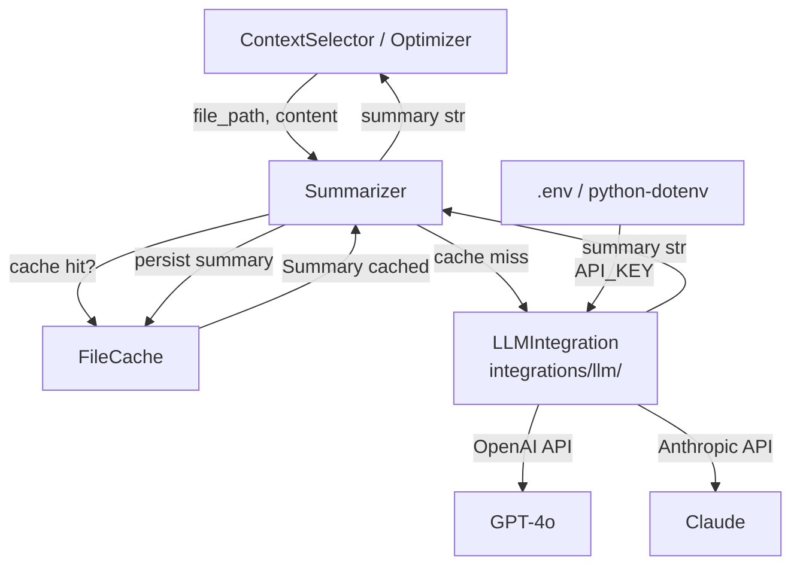
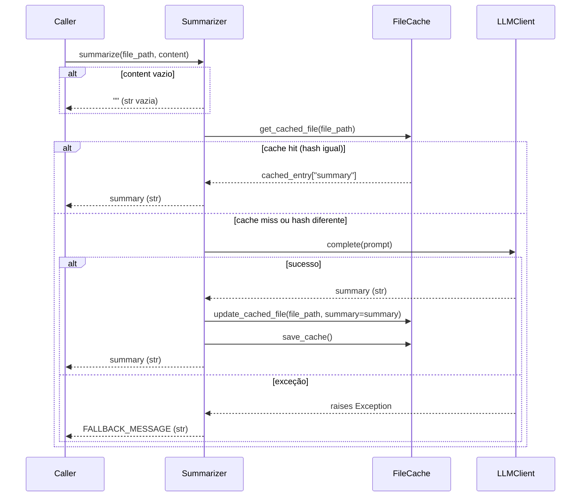

# Design Document — tokemize-summarizer

## Overview

O módulo `summarizer.py` adiciona ao pipeline Tokemize a capacidade de substituir o
conteúdo completo de um arquivo por um resumo técnico compacto gerado via LLM, quando
o budget de tokens é limitado. Isso reduz o custo de chamadas ao LLM sem perder
informação estrutural essencial sobre o arquivo.

O `Summarizer` é um componente de serviço puro: recebe um caminho de arquivo e seu
conteúdo, consulta o `FileCache` antes de chamar a API, e retorna sempre uma `str` —
seja o resumo gerado, o resumo cacheado, ou uma mensagem de fallback controlada em
caso de falha. O pipeline nunca é interrompido por falhas do LLM.

### Posição no Pipeline

```
ContextSelector
    ↓ arquivo relevante com token_count > budget disponível
Summarizer
    ↓ resumo técnico compacto (str)
Optimizer / ContextSelector
    ↓ contexto final montado
LLM (OpenAI / Anthropic)
```

O `Summarizer` é invocado pelo `ContextSelector` (ou `Optimizer`) quando um arquivo
relevante não cabe inteiro no budget restante. O resumo substitui o conteúdo completo
na montagem do contexto final.

---

## Architecture

### Diagrama de Componentes



### Decisões de Design

**1. Summarizer não instancia o LLM_Client**
O `Summarizer` recebe o `LLM_Client` via injeção de dependência no construtor. Isso
mantém a regra do projeto de nunca instanciar clientes de LLM fora de
`integrations/llm/`, e facilita testes com mocks.

**2. FileCache opcional via injeção de dependência**
O `FileCache` também é injetado. Se `None`, o `Summarizer` opera sem cache. Isso
permite uso isolado em testes e contextos onde cache não é desejado.

**3. Fallback silencioso em falhas de API**
Qualquer exceção lançada pelo `LLM_Client` é capturada, logada e substituída por uma
`Fallback_Message` predefinida. O pipeline nunca recebe uma exceção do `Summarizer`.

**4. Prompt de sumarização encapsulado no Summarizer**
O prompt enviado ao LLM é responsabilidade do `Summarizer`. Isso centraliza a lógica
de instrução e facilita ajustes sem alterar o pipeline.

**5. Localização do módulo**
O `Summarizer` reside em `src/tokemize/summarizer.py`, no mesmo nível de `cache.py`
e `selector.py`, seguindo a estrutura existente do projeto.

---

## Components and Interfaces

### `Summarizer` (src/tokemize/summarizer.py)

Classe principal do módulo. Orquestra cache lookup → chamada ao LLM → persistência
no cache → retorno do resumo.

```python
class Summarizer:
    def __init__(
        self,
        llm_client: LLMClientProtocol,
        cache: FileCache | None = None,
    ) -> None: ...

    def summarize(
        self,
        file_path: str | Path,
        content: str,
    ) -> str: ...
```

**Responsabilidades:**
- Verificar cache antes de chamar o LLM
- Construir o prompt de sumarização
- Chamar `llm_client.complete(prompt)` (ou equivalente)
- Persistir o resumo no cache após geração bem-sucedida
- Capturar exceções do LLM e retornar `Fallback_Message`
- Logar todas as operações relevantes (sem expor conteúdo ou API key)

### `LLMClientProtocol` (src/tokemize/integrations/llm/)

Protocolo (interface) que o `Summarizer` usa para se comunicar com qualquer provedor
de LLM. Definido como `typing.Protocol` para desacoplamento.

```python
from typing import Protocol

class LLMClientProtocol(Protocol):
    def complete(self, prompt: str) -> str:
        """Envia um prompt ao LLM e retorna a resposta como str."""
        ...
```

Implementações concretas (`OpenAIClient`, `AnthropicClient`) residem em
`src/tokemize/integrations/llm/` e são responsáveis por:
- Carregar a `API_Key` via `python-dotenv`
- Lançar `EnvironmentError` se a variável de ambiente não estiver definida
- Nunca logar o valor da chave

### `FileCache` (src/tokemize/cache.py) — reutilizado

O `FileCache` existente já suporta o campo `summary` em `update_cached_file`. O
`Summarizer` usa os métodos:
- `get_cached_file(file_path)` → retorna entrada ou `None`
- `update_cached_file(file_path, summary=..., ...)` → persiste o resumo
- `save_cache()` → persiste em disco após atualização

---

## Data Models

### Fluxo de dados interno do `Summarizer`



### Estrutura da entrada de cache para resumos

O `FileCache` existente já possui o campo `summary` em sua estrutura. O `Summarizer`
lê e escreve apenas esse campo, sem alterar os demais (`symbols`, `imports`, etc.).

```python
# Entrada no FileCache após sumarização
{
    "file_path": "/abs/path/to/file.py",
    "content_hash": "sha256hex...",
    "symbols": [],          # não alterado pelo Summarizer
    "imports": [],          # não alterado pelo Summarizer
    "summary": "Este módulo implementa...",  # escrito pelo Summarizer
    "token_estimate": 0,    # não alterado pelo Summarizer
    "metadata": {},         # não alterado pelo Summarizer
}
```

### Constantes do módulo

```python
FALLBACK_MESSAGE: str = "[Resumo indisponível: falha ao contatar o serviço de LLM]"

SUMMARY_PROMPT_TEMPLATE: str = """
Você é um assistente técnico especializado em análise de código-fonte.
Gere um resumo técnico compacto do arquivo abaixo.
O resumo deve cobrir: propósito do arquivo, estruturas principais (classes, funções,
tipos), dependências externas relevantes e padrões de design utilizados.
Seja objetivo e conciso. Não inclua o código-fonte no resumo.

Arquivo: {file_path}

{content}
"""
```

---

## Correctness Properties

*A property is a characteristic or behavior that should hold true across all valid
executions of a system — essentially, a formal statement about what the system should
do. Properties serve as the bridge between human-readable specifications and
machine-verifiable correctness guarantees.*

### Property 1: Conteúdo vazio retorna string vazia sem chamar o LLM

*Para qualquer* `file_path` válido, se `content` for uma string vazia, o `Summarizer`
SHALL retornar `""` e o `LLM_Client` não SHALL ser invocado nenhuma vez.

**Validates: Requirements 1.5**

---

### Property 2: Cache hit evita chamada ao LLM

*Para qualquer* `file_path` e `content` não vazio, se o `FileCache` já contiver um
resumo com o mesmo hash de conteúdo, o `Summarizer` SHALL retornar o resumo cacheado
e o `LLM_Client` não SHALL ser invocado nenhuma vez.

**Validates: Requirements 2.1**

---

### Property 3: Resumo gerado é persistido no cache

*Para qualquer* `file_path` e `content` não vazio que resulte em cache miss, após uma
chamada bem-sucedida ao `LLM_Client`, o `FileCache` SHALL conter uma entrada para
`file_path` com o campo `summary` igual ao valor retornado pelo `LLM_Client`.

**Validates: Requirements 2.2**

---

### Property 4: Falha do LLM retorna fallback sem propagar exceção

*Para qualquer* `file_path` e `content` não vazio, se o `LLM_Client` lançar qualquer
exceção, o `Summarizer` SHALL retornar a `FALLBACK_MESSAGE` predefinida (str não
vazia), não SHALL propagar a exceção, e não SHALL persistir nenhuma entrada no
`FileCache` para aquela chamada.

**Validates: Requirements 3.1, 3.2, 3.3, 3.4**

---

### Property 5: Invalidação de cache por mudança de conteúdo

*Para qualquer* `file_path` com uma entrada existente no `FileCache`, se o `content`
fornecido produzir um hash diferente do hash armazenado, o `Summarizer` SHALL chamar
o `LLM_Client` e persistir um novo resumo, substituindo a entrada anterior.

**Validates: Requirements 2.3**

---

## Error Handling

### Falhas do LLM_Client

Qualquer exceção lançada por `llm_client.complete(prompt)` é capturada com um bloco
`except Exception` amplo. O `Summarizer` loga o erro com `logger.error(...)` (sem
expor o conteúdo do arquivo ou a API key) e retorna `FALLBACK_MESSAGE`.

```python
try:
    summary = self._llm_client.complete(prompt)
except Exception as exc:
    logger.error(
        "Falha ao gerar resumo para '%s': %s",
        file_path,
        type(exc).__name__,   # apenas o tipo, não a mensagem completa
    )
    return FALLBACK_MESSAGE
```

### Variável de ambiente ausente

A validação da `API_Key` ocorre na camada `integrations/llm/`, não no `Summarizer`.
O cliente concreto (`OpenAIClient`, `AnthropicClient`) lança `EnvironmentError` com
mensagem descritiva se a variável não estiver definida. Esse erro **não** é capturado
pelo `Summarizer` — é um erro de configuração que deve interromper a inicialização.

### Falhas do FileCache

Erros de I/O no `FileCache` (ex: disco cheio ao salvar) são tratados internamente
pelo próprio `FileCache` (já implementado com `try/except` em `save_cache`). O
`Summarizer` não precisa tratar esses erros adicionalmente.

### Resumo vazio retornado pelo LLM

Se o LLM retornar uma string vazia ou apenas whitespace, o `Summarizer` trata como
resultado válido e o persiste no cache. Não é responsabilidade do `Summarizer`
validar a qualidade do resumo.

---

## Testing Strategy

### Abordagem Dual

O módulo usa **testes unitários com mocks** para cobrir exemplos concretos e casos de
borda, e **testes baseados em propriedades** (property-based testing) para verificar
invariantes universais com entradas geradas aleatoriamente.

### Property-Based Testing

**Biblioteca:** `hypothesis` (padrão de facto para PBT em Python)

Cada propriedade do design é implementada como um único teste com `@given`, configurado
para rodar no mínimo 100 iterações. Cada teste é anotado com um comentário referenciando
a propriedade do design:

```
# Feature: tokemize-summarizer, Property N: <texto da propriedade>
```

**Propriedades a implementar:**

| Teste | Propriedade | Requisito |
|---|---|---|
| `test_empty_content_returns_empty_no_llm_call` | Property 1 | 1.5 |
| `test_cache_hit_skips_llm` | Property 2 | 2.1 |
| `test_successful_summary_persisted_in_cache` | Property 3 | 2.2 |
| `test_llm_failure_returns_fallback_no_exception` | Property 4 | 3.1–3.4 |
| `test_content_change_invalidates_cache` | Property 5 | 2.3 |

**Estratégias de geração (Hypothesis):**

```python
from hypothesis import given, settings
from hypothesis import strategies as st

# Gera file_path como string não vazia (simula caminhos de arquivo)
file_path_strategy = st.text(min_size=1).map(lambda s: s.strip() or "file.py")

# Gera content não vazio (qualquer texto de código)
content_strategy = st.text(min_size=1)

# Gera summary como texto não vazio retornado pelo LLM mock
summary_strategy = st.text(min_size=1)
```

### Testes Unitários (pytest)

Cobrem casos específicos e de borda não adequados para PBT:

- `test_summarize_returns_str` — tipo de retorno é sempre `str`
- `test_summarize_without_cache` — operação sem `FileCache` (cache=None)
- `test_summarize_logs_cache_hit` — logging de cache hit
- `test_summarize_logs_cache_miss` — logging de cache miss
- `test_fallback_message_is_nonempty` — `FALLBACK_MESSAGE` não é vazia
- `test_llm_client_injected_not_instantiated` — `Summarizer` não instancia LLM diretamente
- `test_api_key_not_logged` — API key não aparece em logs

### Mocks

Todos os testes usam mocks para `LLMClientProtocol` e `FileCache`:

```python
from unittest.mock import MagicMock, patch

mock_llm = MagicMock(spec=LLMClientProtocol)
mock_cache = MagicMock(spec=FileCache)
```

### Localização dos testes

```
tests/
└── test_summarizer.py   # espelha src/tokemize/summarizer.py
```

### Configuração do pytest

Nenhuma alteração necessária no `pyproject.toml` existente. Adicionar `hypothesis`
como dependência de desenvolvimento:

```toml
[project.optional-dependencies]
dev = [
    "pytest==8.3.5",
    "pytest-cov==6.1.0",
    "hypothesis>=6.100.0",   # PBT
]
```
