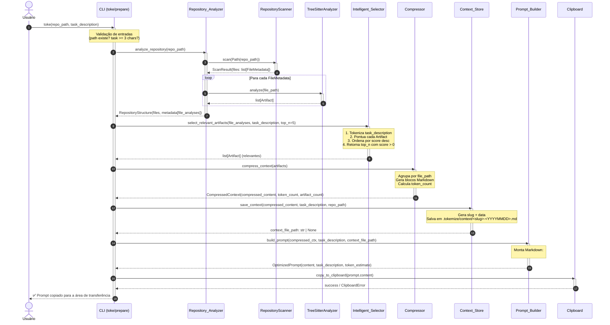

# Diagrama de Sequência — Pipeline Tokemize

## Fluxo Principal (CLI)

## Descrição das Etapas

| # | Etapa | Componente | Entrada | Saída |
|---|-------|-----------|---------|-------|
| 1 | Análise do Repositório | `Repository_Analyzer` | `repo_path: str` | `RepositoryStructure` com `list[FileAnalysis]` |
| 2 | Seleção Inteligente | `Intelligent_Selector` | `list[FileAnalysis]`, `task_description` | `list[Artifact]` (top N relevantes) |
| 3 | Compressão | `Compressor` | `list[Artifact]` | `CompressedContext` (Markdown compacto) |
| 4 | Persistência | `Context_Store` | `compressed_content`, `task_description`, `repo_path` | Caminho do arquivo salvo (ou `None`) |
| 5 | Geração de Prompt | `Prompt_Builder` | `CompressedContext`, `task_description`, `context_file_path` | `OptimizedPrompt` |
| 6 | Clipboard | `Clipboard` | `prompt.content: str` | Cópia para área de transferência |

## Modelos de Dados Principais

- **`FileMetadata`** — Metadados de arquivo (path, linguagem, tamanho, linhas)
- **`Artifact`** — Unidade sintática extraída (nome, tipo, linhas, conteúdo, linguagem)
- **`FileAnalysis`** — Arquivo + seus artefatos extraídos
- **`CompressedContext`** — Contexto compactado em Markdown com contagem de tokens
- **`OptimizedPrompt`** — Prompt final pronto para o chatbot da IDE

## Notas

- A etapa **Context_Store** é **não-fatal**: falhas de I/O são capturadas e o pipeline continua.
- O **TreeSitterAnalyzer** suporta Python, Java, JavaScript e TypeScript.
- Arquivos com linguagem não suportada recebem `artifacts=[]` sem propagar exceção.
- O **Intelligent_Selector** usa heurística de palavras-chave (sem embeddings) para ranquear artefatos.
